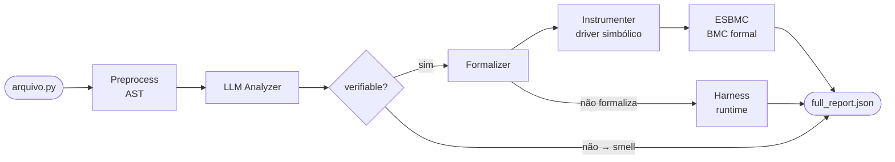

# llm-esbmc-pipeline

Pipeline de pesquisa que combina análise semântica por LLM com verificação formal por Bounded Model Checking (ESBMC) para detectar e confirmar bugs de runtime em código Python.

> **Contexto:** Dissertação de mestrado — PPGINF / Verificação de Software e Sistemas.
> O pipeline investiga se LLMs podem orientar o ESBMC a verificar propriedades que o BMC sozinho não alcançaria, por falta de ponto de entrada nas funções.

---

## Como funciona (resumo)



**Flow A** (esbmc-direct): ESBMC roda direto no arquivo original — baseline, sem LLM.

**Flow B** (llm-first): LLM identifica hipóteses → Formalizer gera assertion → Instrumenter adiciona driver simbólico → ESBMC verifica formalmente.

**Modo full**: Flow A + Flow B combinados no mesmo relatório.

---

## Instalação

```bash
git clone <repo>
cd llm-esbmc-pipeline
python -m venv .venv
source .venv/bin/activate   # Windows: .venv\Scripts\activate
pip install -r requirements.txt
```

**Requisito externo:** ESBMC 8.0+ no PATH (`esbmc --version`).

---

## Configuração

Copie `.env.example` para `.env` e preencha as chaves necessárias:

```bash
cp .env.example .env
```

```env
OPENAI_API_KEY=       # para modelo gpt-*
ANTHROPIC_API_KEY=    # para modelo claude-*
# OLLAMA_BASE_URL=    # opcional, padrão: http://localhost:11434/v1
```

---

## Como rodar

### Modo `full` — recomendado

```bash
python src/main.py --mode full \
  --input dataset/labeled/ok/bugs \
  --model gpt-4o \
  --bound 5 \
  --timeout 30 \
  --report reports/json/full_report.json
```

### Modo `esbmc-direct` — baseline sem LLM

```bash
python src/main.py --mode esbmc-direct \
  --input dataset/labeled/ok/bugs \
  --bound 5 \
  --timeout 30
```

### Modo `benchmark` — avaliação com ground truth

```bash
python src/main.py --mode benchmark \
  --input dataset/labeled/ground_truths/bugs \
  --model gpt-4o \
  --bound 5 \
  --timeout 30
```

### Modo `llm-first` — só Flow B

```bash
python src/main.py --mode llm-first \
  --input dataset/labeled/ok/bugs \
  --model gpt-4o \
  --bound 5
```

Veja [`docs/modes.md`](docs/modes.md) para a referência completa.

---

## Backends LLM

| Backend | Alias `--model` | Modelo padrão |
|---|---|---|
| OpenAI | `gpt-4o`, `gpt-4o-mini`, `o1`, ... | `gpt-4o` |
| Anthropic | `claude` | `claude-sonnet-4-6` |
| Ollama | `qwen2.5-coder:7b`, `llama3.2`, ... | `qwen2.5-coder:7b` |

---

## Categorias analisadas

### Bugs formais (verificáveis pelo ESBMC)

| Categoria | Exceção esperada | Exemplo |
|---|---|---|
| `division_by_zero` | `ZeroDivisionError` | `a // b` sem guarda |
| `out_of_bounds` | `IndexError` | `lst[i]` sem bounds check |
| `assertion_violation` | `AssertionError` | `assert cond` ou `raise AssertionError` |

### Code smells (heurísticos)

| Categoria | Critério |
|---|---|
| `long_method` | Função excessivamente longa |
| `many_parameters` | ≥ 5 parâmetros |
| `complex_conditional` | Múltiplos branches / aninhamentos |

---

## Classificações finais

### Trilha formal (ESBMC)

| Classificação | Descrição |
|---|---|
| `llm_confirmed_by_esbmc` | LLM encontrou, ESBMC confirmou formalmente (**principal**) |
| `not_confirmed_within_bound` | ESBMC verificou sem encontrar violação no bound |
| `esbmc_inconclusive` | Erro, timeout ou resultado ambíguo do ESBMC |
| `esbmc_native_bug` | ESBMC direto encontrou sem ajuda da LLM |
| `llm_missed_esbmc_bug` | ESBMC encontrou bug que a LLM não reportou |

### Trilha runtime (harness auxiliar)

| Classificação | Descrição |
|---|---|
| `runtime_reproduced_by_harness` | Execução concreta reproduziu a exceção (**auxiliar**, não é prova formal) |
| `runtime_not_reproduced` | Harness não reproduziu a exceção esperada |
| `runtime_inconclusive` | Harness rejeitado, timeout ou erro de execução |

### Rejeição / heurística

| Classificação | Descrição |
|---|---|
| `llm_false_positive` | Expressão não existe no código executável (alucinação) |
| `heuristic_smell_only` | Smell de qualidade, sem verificação formal |
| `skipped_not_verifiable` | Não formalizável e sem harness disponível |
| `out_of_scope_finding` | Categoria fora das 5 aceitas pelo MVP |
| `no_vcc_generated` | ESBMC direto: 0 VCCs (arquivo sem ponto de entrada) |

Veja [`docs/classification.md`](docs/classification.md) para o fluxo de decisão completo.

---

## Estrutura do projeto

```
llm-esbmc-pipeline/
├── src/
│   └── main.py                    # Ponto de entrada CLI
├── research_pipeline/
│   ├── preprocess.py              # Análise AST do código Python
│   ├── llm/                       # Módulo LLM (backends, prompts, findings)
│   │   ├── backends/              # OpenAI, Anthropic, Ollama
│   │   ├── categories.py          # Categorias MVP
│   │   ├── findings.py            # Normalização e validação de findings
│   │   └── prompts.py             # System prompt e schema JSON
│   ├── formalizer.py              # Geração de propriedades formais
│   ├── instrumenter.py            # Injeção de assert + driver simbólico
│   ├── esbmc_runner.py            # Execução e classificação do ESBMC
│   ├── runtime_harness_validator.py # Fallback: execução controlada de harness
│   ├── pipeline.py                # Orquestração dos flows
│   ├── report.py                  # Consolidação e classificação final
│   ├── full_report.py             # JSON hierárquico por arquivo
│   ├── evaluator.py               # Métricas: P, R, F1
│   └── models.py                  # Dataclasses e constantes
├── dataset/
│   └── labeled/
│       ├── ok/                    # Arquivos Python do benchmark
│       │   ├── bugs/
│       │   ├── clean/
│       │   └── smells/
│       └── ground_truths/         # Anotações esperadas
├── scripts/                       # Utilitários: compare_llms, evaluate, etc.
├── tests/
│   └── test_research_pipeline.py  # Testes unitários sem API
├── docs/                          # Documentação técnica
├── .env.example                   # Template de variáveis de ambiente
└── requirements.txt
```

---

## Documentação técnica

| Documento | Conteúdo |
|---|---|
| [`docs/v1.md`](docs/v1.md) | **Escopo V1 — artigo:** fluxo, categorias, classificações, métricas, tabelas |
| [`docs/v2.md`](docs/v2.md) | **Escopo V2 — trabalho futuro:** harness runtime, validação concreta |
| [`docs/architecture.md`](docs/architecture.md) | Arquitetura detalhada de cada camada |
| [`docs/pipeline_flow.md`](docs/pipeline_flow.md) | Diagramas de fluxo por modo |
| [`docs/classification.md`](docs/classification.md) | Todas as classificações com fluxo de decisão |
| [`docs/modes.md`](docs/modes.md) | Referência completa dos modos de execução |
| [`docs/current_limitations.md`](docs/current_limitations.md) | Limitações conhecidas e status |

---

## Testes

```bash
# Testes unitários (sem API)
pytest tests/

# Smoke test
python -c "from research_pipeline.pipeline import run_full_pipeline; print('OK')"

# ESBMC direto nos exemplos
python src/main.py --mode esbmc-direct --input dataset/labeled/ok/bugs --bound 5
```
