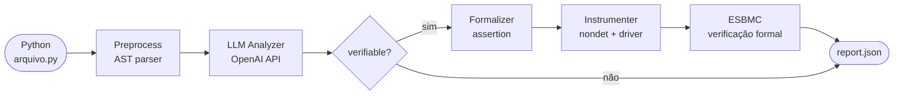

# llm-esbmc-pipeline

Research pipeline that combines LLM-based bug analysis with ESBMC formal verification to automatically detect and verify runtime errors in Python programs.

## Pipeline

```mermaid
flowchart LR
    A([Python\narquivo.py]) --> B[Preprocess\nAST parser]
    B --> C[LLM Analyzer\nOpenAI API]
    C --> D{verifiable?}
    D -- sim --> E[Formalizer\nassertion]
    E --> F[Instrumenter\nnondet + driver]
    F --> G[ESBMC\nverificação formal]
    G --> H([report.json])
    D -- não --> H

```
