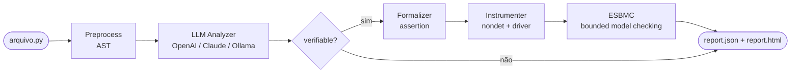

# llm-esbmc-pipeline

Pipeline de pesquisa que combina análise por LLM com verificação formal pelo ESBMC para detectar e confirmar bugs de runtime em código Python. O objetivo é estudar quanto diferentes modelos (LLMs e SLMs) conseguem identificar bugs reais e smells de código, e validar as suspeitas formalmente com bounded model checking.

## Sumário

- [Como funciona](#como-funciona)
- [Estrutura do projeto](#estrutura-do-projeto)
- [Instalação](#instalação)
- [Configuração de chaves de API](#configuração-de-chaves-de-api)
- [Como rodar](#como-rodar)
- [Avaliação e comparação de modelos](#avaliação-e-comparação-de-modelos)
- [Relatório HTML](#relatório-html)
- [Backends LLM suportados](#backends-llm-suportados)
- [Categorias de achados](#categorias-de-achados)
- [Classificações finais](#classificações-finais)
- [Ground truth e arquivos rotulados](#ground-truth-e-arquivos-rotulados)

---

## Como funciona

O pipeline passa por 6 etapas para cada arquivo Python analisado:



### Etapa 1 — Preprocess (`research_pipeline/preprocess.py`)

Usa o módulo `ast` do Python para analisar cada função e extrair:

- Operações de divisão (`/`, `//`, `%`) e acessos indexados (`lst[i]`)
- Guards já existentes (`if x != 0`, `assert`, condicionais de guarda)
- Métricas estruturais: número de linhas, parâmetros, branches aninhados

Gera um objeto `CodeUnit` por função, que representa a unidade de análise.

### Etapa 2 — LLM Analyzer (`research_pipeline/llm_analyzer.py`)

Envia cada `CodeUnit` para o LLM com um prompt que solicita dois tipos de achados em JSON:

| Tipo | Campo `verifiable` | O que é |
|---|---|---|
| `suspected_bug` | `true` | Divisão por zero ou out-of-bounds com operando variável sem guarda — verificável formalmente |
| `smell_heuristic` | `false` | Problema de qualidade de código (naming, complexidade, etc.) — não verificável formalmente |

O LLM retorna JSON validado por schema. Um passo de **normalização** descarta achados onde o LLM alucinaste operações inexistentes (cross-referencia com o AST).

### Etapa 3 — Formalizer (`research_pipeline/formalizer.py`)

Para cada achado `verifiable=true`, gera uma `FormalProperty` com a assertion que o ESBMC vai verificar:

- `division_by_zero` → `assert (denominador) != 0`
- `out_of_bounds` → `assert (0 <= índice) and (índice < len(lista))`

### Etapa 4 — Instrumenter (`research_pipeline/instrumenter.py`)

Pega o arquivo original e injeta:

1. O `assert` da propriedade formal logo antes da operação suspeita
2. Uma função `__esbmc_driver__()` com variáveis simbólicas (`nondet_int()`, `nondet_float()`, etc.) para o ESBMC explorar todos os valores possíveis via bounded model checking

O arquivo instrumentado é salvo em `artifacts/research-pipeline/instrumented/`.

### Etapa 5 — ESBMC (`research_pipeline/esbmc_runner.py`)

Executa `esbmc --python python3 --incremental-bmc <arquivo_instrumentado.py>` e classifica:

| Resultado | Significado |
|---|---|
| `violation_found` | Bug confirmado formalmente com contraexemplo |
| `no_violation_found` | Hipótese não confirmada no escopo analisado |
| `skipped` | ESBMC não instalado ou não encontrado no PATH |

### Etapa 6 — Report (`research_pipeline/report.py`)

Consolida tudo em `artifacts/research-pipeline/report.json` e gera `report.html` automaticamente.

---

## Estrutura do projeto

```
llm_esbmc/
├── research_pipeline/        # Módulo principal do pipeline
│   ├── preprocess.py         # Parser AST → CodeUnit
│   ├── llm_analyzer.py       # Clientes OpenAI, Anthropic, Ollama
│   ├── formalizer.py         # Gera FormalProperty (assertions)
│   ├── instrumenter.py       # Injeta assert + driver no código
│   ├── esbmc_runner.py       # Executa o ESBMC
│   ├── report.py             # Consolida e salva report.json
│   ├── evaluator.py          # Lógica de avaliação TP/FP/FN
│   ├── models.py             # Dataclasses compartilhadas
│   └── pipeline.py           # Orquestrador (run_pipeline_multi)
│
├── scripts/
│   ├── run_research_pipeline.py  # CLI principal: analisa arquivos
│   ├── evaluate.py               # Avalia um modelo contra ground truth
│   ├── compare_eval.py           # Compara vários modelos lado a lado
│   └── report_html.py            # Gera/regenera o relatório HTML
│
├── examples/
│   ├── labeled/              # Arquivos com bugs/smells conhecidos
│   │   ├── ground_truth.json # Verdade: o que cada arquivo deveria detectar
│   │   ├── div_zero_real.py  # Bug real: divisão por zero
│   │   ├── div_zero_guarded.py  # Divisão protegida (sem bug)
│   │   ├── oob_real.py       # Bug real: out-of-bounds
│   │   ├── oob_guarded.py    # Acesso protegido (sem bug)
│   │   ├── smells_only.py    # Só smells, sem bugs
│   │   └── clean.py          # Código limpo (nada esperado)
│   └── *.py                  # Arquivos avulsos para testes rápidos
│
├── artifacts/
│   └── research-pipeline/
│       ├── report.json       # Último relatório gerado
│       ├── report.html       # Relatório visual (abre no navegador)
│       ├── instrumented/     # Arquivos Python instrumentados pelo pipeline
│       └── logs/             # Saída bruta do ESBMC
│
├── .env                      # Chaves de API (não commitado)
├── .env.example              # Template das variáveis de ambiente
└── requirements.txt
```

---

## Instalação

**Pré-requisitos:** Python 3.10+, pip, git.

No WSL (Ubuntu) ou Linux:

```bash
# 1. Instalar suporte a venv se necessário
sudo apt install python3-venv python3-full

# 2. Criar e ativar o ambiente virtual
python3 -m venv .venv
source .venv/bin/activate

# 3. Instalar dependências
pip install python-dotenv

# Para usar OpenAI
pip install openai

# Para usar Anthropic (Claude)
pip install anthropic

# Para verificação formal (opcional)
pip install ast2json
```

**ESBMC** (opcional — o pipeline funciona sem ele):
Baixe o binário em https://github.com/esbmc/esbmc/releases e coloque-o no PATH, ou passe o caminho com `--esbmc-command`.

**Ollama** (opcional — para SLMs locais):
```bash
curl -fsSL https://ollama.com/install.sh | sh
ollama pull qwen2.5-coder:7b
```

---

## Configuração de chaves de API

Copie o arquivo de exemplo e preencha as chaves:

```bash
cp .env.example .env
```

`.env`:
```
ANTHROPIC_API_KEY=sk-ant-...
OPENAI_API_KEY=sk-...

# Ollama roda localmente, não precisa de chave.
# OLLAMA_BASE_URL=http://localhost:11434/v1
```

O pipeline carrega automaticamente o `.env` ao rodar. As chaves também podem ser passadas diretamente como argumento (`--anthropic-api-key`, `--openai-api-key`).

---

## Como rodar

Sempre ative o venv antes:

```bash
source .venv/bin/activate
```

### Análise de arquivo(s)

```bash
# Com Claude (Anthropic) — padrão: claude-sonnet-4-6
python scripts/run_research_pipeline.py examples/minimal_index_division.py --llm-backend anthropic

# Com OpenAI — padrão: gpt-4o
python scripts/run_research_pipeline.py examples/minimal_index_division.py --llm-backend openai

# Com Ollama (modelo local) — padrão: qwen2.5-coder:7b
python scripts/run_research_pipeline.py examples/minimal_index_division.py --llm-backend ollama

# Modelo específico
python scripts/run_research_pipeline.py examples/bug_unguarded.py \
    --llm-backend anthropic --llm-model claude-opus-4-7

# Múltiplos arquivos
python scripts/run_research_pipeline.py examples/labeled/*.py --llm-backend openai

# Com ESBMC em caminho personalizado
python scripts/run_research_pipeline.py examples/minimal_index_division.py \
    --llm-backend anthropic --esbmc-command /opt/esbmc/bin/esbmc --python
```

Após rodar, o relatório é salvo em `artifacts/research-pipeline/report.json` e o HTML abre automaticamente no navegador.

---

## Avaliação e comparação de modelos

O pipeline tem infraestrutura de avaliação baseada em **ground truth rotulado** (`examples/labeled/ground_truth.json`). Cada arquivo rotulado declara o que deveria ser detectado, permitindo calcular Precision, Recall e F1 separadamente para bugs e smells.

### Avaliar um único modelo

```bash
# Avaliar Claude Sonnet (padrão)
python scripts/evaluate.py

# Avaliar GPT-4o
python scripts/evaluate.py --llm-backend openai --llm-model gpt-4o

# Avaliar modelo local via Ollama
python scripts/evaluate.py --llm-backend ollama --llm-model qwen2.5-coder:7b

# Avaliar Claude Opus
python scripts/evaluate.py --llm-backend anthropic --llm-model claude-opus-4-7
```

Saída esperada:

```
=== MÉTRICAS: anthropic/claude-sonnet-4-6 ===
Categoria              TP   FP   FN   Precision   Recall     F1
----------------------------------------------------------------
Bugs (verifiable)       2    0    0       100%     100%    100%
Smells (heuristic)      3    1    0        75%     100%     86%
----------------------------------------------------------------
Overall                 5    1    0        83%     100%     91%
```

### Comparar múltiplos modelos

```bash
# Comparar Claude Sonnet vs GPT-4o (padrão)
python scripts/compare_eval.py

# Comparar modelos específicos
python scripts/compare_eval.py \
    --models anthropic:claude-sonnet-4-6 anthropic:claude-opus-4-7 openai:gpt-4o

# Incluir modelo local
python scripts/compare_eval.py \
    --models anthropic:claude-sonnet-4-6 openai:gpt-4o ollama:qwen2.5-coder:7b
```

Saída esperada:

```
=== COMPARAÇÃO DE MODELOS ===
Modelo                               | Bug P  Bug R  Bug F1 | Smell P  Smell R  Smell F1 | Overall F1
------------------------------------------------------------------------------------------------------
anthropic/claude-sonnet-4-6          |  100%   100%    100% |    75%     100%      86%  |        91%
openai/gpt-4o                        |  100%   100%    100% |    50%     100%      67%  |        80%
ollama/qwen2.5-coder:7b              |   50%   100%     67% |     0%       0%       0%  |        40%
```

### Como funciona o ground truth

O arquivo `examples/labeled/ground_truth.json` define os achados esperados por arquivo:

```json
{
  "div_zero_real.py": {
    "expected_findings": [
      {"function": "divide", "category": "division_by_zero", "verifiable": true}
    ]
  },
  "smells_only.py": {
    "expected_findings": [
      {"function": "proc", "category": "many_parameters",    "verifiable": false},
      {"function": "proc", "category": "complex_conditional","verifiable": false},
      {"function": "proc", "category": "poor_naming",        "verifiable": false}
    ]
  },
  "clean.py": {
    "expected_findings": []
  }
}
```

Para adicionar um novo arquivo ao benchmark, crie o `.py` em `examples/labeled/` e adicione a entrada correspondente no `ground_truth.json`.

---

## Relatório HTML

O relatório HTML é gerado automaticamente ao rodar `run_research_pipeline.py`. Para regenerar a partir de um `report.json` existente:

```bash
python scripts/report_html.py
```

O relatório mostra:

- **Barra de estatísticas**: total de achados, bugs verificáveis, confirmados pelo ESBMC, e métricas de ground truth (TP/FP/FN) quando os arquivos analisados fazem parte do benchmark
- **Tabela resumo** com filtros por tipo de achado e veredito
- **Cards detalhados** por achado: função, categoria, raciocínio do LLM, assertion gerada, resultado do ESBMC com contraexemplo

Os vereditos de comparação com ground truth são:

| Símbolo | Veredito | Significado |
|---|---|---|
| ✅ | TP (Correto) | O modelo detectou o que era esperado |
| ⚠️ | TP parcial | Detectou o achado mas `verifiable` estava errado |
| ❌ | FP (Falso positivo) | Detectou algo que não estava no ground truth |
| 🔴 | FN (Falso negativo) | Deixou de detectar algo esperado |
| — | Sem GT | Arquivo não está no benchmark |

---

## Backends LLM suportados

| Backend | Argumento | Modelo padrão | Observação |
|---|---|---|---|
| Anthropic (Claude) | `--llm-backend anthropic` | `claude-sonnet-4-6` | Requer `ANTHROPIC_API_KEY` |
| OpenAI | `--llm-backend openai` | `gpt-4o` | Requer `OPENAI_API_KEY` |
| Ollama (local) | `--llm-backend ollama` | `qwen2.5-coder:7b` | Requer Ollama rodando localmente |

**Modelos sugeridos por backend:**

| Backend | Modelos | Observação |
|---|---|---|
| Anthropic | `claude-sonnet-4-6`, `claude-opus-4-7`, `claude-haiku-4-5-20251001` | Sonnet tem melhor custo-benefício |
| OpenAI | `gpt-4o`, `gpt-4o-mini`, `o3-mini` | GPT-4o é o mais capaz |
| Ollama | `qwen2.5-coder:7b`, `llama3.2`, `mistral`, `phi4`, `gemma3` | qwen2.5-coder é o mais forte para código |

---

## Categorias de achados

### Bugs formais (`verifiable=true`)

O LLM suspeita de um bug real, o pipeline gera uma assertion e o ESBMC tenta confirmar formalmente.

| Categoria | Descrição | Assertion gerada |
|---|---|---|
| `division_by_zero` | Divisão com denominador variável sem guarda | `assert (n) != 0` |
| `out_of_bounds` | Acesso indexado com índice variável sem guarda | `assert (0 <= i) and (i < len(lst))` |

### Smells heurísticos (`verifiable=false`)

Problemas de qualidade de código que não geram assertion nem passam pelo ESBMC.

| Categoria | Descrição |
|---|---|
| `long_method` | Função com muitas linhas |
| `complex_conditional` | Muitos ramos ou condicionais aninhados |
| `many_parameters` | Função com muitos parâmetros |
| `missing_validation` | Parâmetros sem validação de entrada |
| `magic_number` | Valores numéricos hardcoded sem nome |
| `poor_naming` | Nomes de variáveis pouco descritivos |

---

## Classificações finais

O `report.json` e o HTML atribuem uma classificação final a cada achado:

| Classificação | Condição | Interpretação |
|---|---|---|
| `formally_confirmed_bug` | ESBMC encontrou violação | Bug comprovado formalmente com contraexemplo |
| `unconfirmed_hypothesis` | LLM suspeitou, ESBMC não confirmou | Suspeita que não virou prova no escopo analisado |
| `vulnerability_potential_with_partial_evidence` | ESBMC não disponível (`skipped`) | LLM suspeita mas sem verificação formal |
| `smell_heuristic` | `verifiable=false` | Qualidade de código, sem verificação formal |
| `inconclusive_case` | Timeout ou erro do ESBMC | Indeterminado por limitação da ferramenta |
