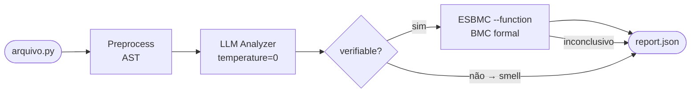

# llm-esbmc-pipeline

Pipeline de pesquisa que combina análise semântica por LLM com verificação formal por Bounded Model Checking (ESBMC) para detectar e confirmar bugs de runtime em código Python.

> **Contexto:** Dissertação de mestrado — PPGINF / Verificação de Software e Sistemas.
> Investiga se LLMs podem orientar o ESBMC a verificar propriedades em funções Python isoladas, usando a função como ponto de entrada simbólico.

---

## Como funciona



| Fluxo | Modo | Descrição |
|---|---|---|
| **Flow A** | `--mode esbmc-only` | ESBMC puro — baseline formal sem LLM |
| **Flow B** | `--mode hybrid` | LLM indica categoria → ESBMC confirma no código original |
| **Flow C** | `--mode llm-only` | LLM puro — baseline de qualidade da IA sem verificação formal |

**Princípio central:** A LLM faz triagem de categoria; o ESBMC decide com semântica formal própria. Nenhum código LLM-gerado entra no loop de verificação.

---

## Dataset (70 arquivos)

| Categoria | Arquivos | Verificável |
|---|---|---|
| `assertion_violation` | av_01–av_15 | ESBMC |
| `division_by_zero` | dz_01–dz_15 | ESBMC |
| `out_of_bounds` | oob_01–oob_15 | ESBMC |
| `clean` | clean_01–clean_10 | controle negativo |
| `complex_conditional` | cc_01–cc_05 | LLM heurístico |
| `long_method` | lm_01–lm_05 | LLM heurístico |
| `many_parameters` | mp_01–mp_05 | LLM heurístico |

Cada arquivo contém exatamente 1 função e 0 ou 1 bug. Sem `len()` (limitação do frontend Python do ESBMC).

---

## Modelos V1

| Modelo | Backend | Tipo |
|---|---|---|
| `gpt-4o` | OpenAI | API (pago) |
| `claude-sonnet-4-6` | Anthropic | API (pago) |
| `deepseek-r1:7b` | Ollama (local) | Reasoning model |
| `qwen2.5-coder:7b` | Ollama (local) | Code model |

---

## Instalação

**Python 3.9+** (usa `ast.unparse()`).

```bash
git clone <repo>
cd llm-esbmc-pipeline
python -m venv .venv
source .venv/bin/activate
pip install -r requirements.txt
```

**Requisito externo:** ESBMC 8.0+ no PATH.

```bash
esbmc --version   # verificar instalação
```

Para modelos locais, instale o [Ollama](https://ollama.ai) e baixe os modelos:

```bash
ollama pull deepseek-r1:7b
ollama pull qwen2.5-coder:7b
```

---

## Configuração

```bash
cp .env.example .env
```

```env
OPENAI_API_KEY=       # para gpt-*
ANTHROPIC_API_KEY=    # para claude-*
# OLLAMA_BASE_URL=    # opcional, padrão: http://localhost:11434
```

---

## Como rodar

### Benchmark V1 (canônico)

```bash
source .env

# Modelos via API
python src/main.py --mode benchmark \
    --input dataset/labeled/ground_truths \
    --model gpt-4o \
    --prompt-mode raw \
    --bound 5 --timeout 30 \
    --report reports/json/v1_benchmark/benchmark_gpt-4o.json

# Modelos locais Ollama (--llm-timeout maior pois inferência é lenta)
python src/main.py --mode benchmark \
    --input dataset/labeled/ground_truths \
    --model deepseek-r1:7b \
    --prompt-mode raw \
    --bound 5 --timeout 30 --llm-timeout 600 \
    --report reports/json/v1_benchmark/benchmark_deepseek-r1-7b.json
```

> **`--prompt-mode raw` é obrigatório** em avaliações científicas. Sem ele, o prompt expõe operações pré-extraídas pelo AST que vazam o tipo de bug. Use `ast_hints` apenas para experimentos de ablação.

Ver todos os comandos em [`TUTORIAL.md`](TUTORIAL.md).

### Modos auxiliares

```bash
# Flow B manual (exploração/debug)
python src/main.py --mode hybrid \
    --input dataset/labeled/ok/bugs \
    --model gpt-4o --bound 5 --timeout 30

# Flow A — ESBMC puro sem LLM
python src/main.py --mode esbmc-only \
    --input dataset/labeled/ok/bugs \
    --bound 5 --timeout 30

# Flow C — só LLM, sem ESBMC
python src/main.py --mode llm-only \
    --input dataset/labeled/ok/bugs \
    --model gpt-4o
```

---

## Prompt e schema LLM

O system prompt (`research_pipeline/prompts/system_prompt.txt`) segue estratégia **role + CoT** própria do projeto, com referências conceituais em Tamberg & Bahsi (IEEE Access 2025):

- **Role:** especialista em segurança de código Python em pipeline híbrido LLM+ESBMC
- **Taxonomia:** bugs formais (verifiable=true) vs. code smells (verifiable=false)
- **CoT:** 4 perguntas de raciocínio antes de gerar o JSON
- **Output:** `{"findings": [...]}` — sem markdown, booleanos JSON (`true`/`false`)

Schema simplificado (5 campos obrigatórios):

```json
{
  "finding_type": "suspected_bug | smell_heuristic | llm_false_positive",
  "category": "division_by_zero | out_of_bounds | assertion_violation | long_method | many_parameters | complex_conditional",
  "explanation": "raciocínio textual",
  "verifiable": true,
  "metadata": { "expression": "x / y" }
}
```

---

## Flags ESBMC por categoria (Flow B)

```python
{
    "division_by_zero":    ["--no-bounds-check"],
    "out_of_bounds":       ["--no-div-by-zero-check", "--assign-param-nondet"],
    "assertion_violation": [],
}
```

`--function <nome>` é sempre usado — torna parâmetros simbólicos e permite BMC isolado por função.

---

## Classificações de resultado

| Classificação | Significado |
|---|---|
| `llm_confirmed_by_esbmc` | LLM + ESBMC confirmaram — principal métrica do Flow B |
| `not_confirmed_within_bound` | ESBMC não encontrou violação no bound |
| `esbmc_inconclusive` | Erro, timeout ou categoria ESBMC não bateu |
| `esbmc_native_bug` | Flow A detectou sem LLM |
| `llm_false_positive` | Expressão alucinada — não existe no AST executável |
| `heuristic_smell_only` | Code smell detectado só pela LLM |
| `out_of_scope_finding` | Categoria fora das 6 do benchmark |

---

## Métricas

O modo `benchmark` calcula:

- **P/R/F1** em nível de finding para bugs (Flow B), smells e Flow A
- **MCC e accuracy** em nível de função (binário: bug vs. não-bug)
- **FCR** — Formal Confirmation Rate: fração das hipóteses LLM confirmadas pelo ESBMC
- **NRR** — Noise Reduction Rate: redução de FP do Flow C para o Flow B
- **Bootstrap 95% CIs** (B=2000, seed=42)

Ver [`docs/benchmark_v1_reference.md`](docs/benchmark_v1_reference.md) para a especificação completa.

---

## Estrutura do projeto

```
llm-esbmc-pipeline/
├── src/
│   └── main.py                     # CLI — --mode benchmark|hybrid|esbmc-only|llm-only
├── research_pipeline/
│   ├── preprocess.py               # Extrai CodeUnit por função via AST
│   ├── pipeline.py                 # Orquestra flows A/B/C
│   ├── report.py                   # consolidate_result() — classificações finais
│   ├── evaluator.py                # EvalCounts, prf(), mcc(), bootstrap_ci()
│   ├── models.py                   # CodeUnit, Finding, ESBMCResult, FinalResult
│   ├── ast_utils.py                # expression_exists_in_executable_ast()
│   ├── llm/
│   │   ├── backends/
│   │   │   ├── openai.py           # Responses API (gpt-*)
│   │   │   ├── anthropic.py        # Messages API (claude-*)
│   │   │   ├── chat_completions.py # Ollama / OpenAI-compat
│   │   │   └── factory.py          # build_analyzer() — detecta backend pelo modelo
│   │   ├── categories.py           # SUPPORTED_CATEGORIES
│   │   ├── findings.py             # Normalização, strip_markdown_json, validação AST
│   │   ├── prompts.py              # build_user_prompt(), prompt modes
│   │   └── schema.py               # FINDINGS_JSON_SCHEMA
│   ├── prompts/
│   │   └── system_prompt.txt       # System prompt (role + CoT)
│   └── verification/
│       └── esbmc_runner.py         # run_esbmc_on_function(), run_esbmc_function_baseline()
├── dataset/
│   └── labeled/
│       ├── ok/                     # 70 arquivos Python
│       └── ground_truths/          # 1 JSON por categoria
├── reports/
│   └── json/v1_benchmark/          # benchmark_*.json por modelo
├── scripts/
│   └── compare_benchmarks.py       # Compara JSONs entre modelos
├── tests/
│   └── test_research_pipeline.py   # 38 passed, 2 skipped (sem API)
├── docs/                           # Documentação técnica
├── .env.example
└── requirements.txt
```

---

## Testes

```bash
python -m pytest tests/test_research_pipeline.py -q
# Esperado: 38 passed, 2 skipped
```

---

## Documentação técnica

| Documento | Conteúdo |
|---|---|
| [`docs/benchmark_v1_reference.md`](docs/benchmark_v1_reference.md) | Especificação completa: fluxos, flags ESBMC, métricas, metodologia |
| [`docs/pipeline_walkthrough.md`](docs/pipeline_walkthrough.md) | Walkthrough arquivo por arquivo do pipeline |
| [`docs/v2_harness_synthesis.md`](docs/v2_harness_synthesis.md) | Proposta de trabalho futuro: síntese de harnesses guiada por LLM |
