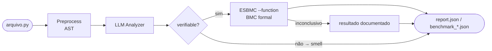

# llm-esbmc-pipeline

Pipeline de pesquisa que combina análise semântica por LLM com verificação formal por Bounded Model Checking (ESBMC) para detectar e confirmar bugs de runtime em código Python.

> **Contexto:** Dissertação de mestrado — PPGINF / Verificação de Software e Sistemas.
> O pipeline investiga se LLMs podem orientar o ESBMC a verificar propriedades que o BMC sozinho não alcançaria, por falta de ponto de entrada nas funções.

---

## Documentação Técnica Oficial

A documentação do projeto foi consolidada em uma única fonte de verdade:

*   [**Referência Oficial do Benchmark V1**](docs/benchmark_v1_reference.md): **LEITURA OBRIGATÓRIA.** Contém toda a especificação de fluxos (A, B, C), métricas (P/R/F1), categorias de bugs e metodologia de matching.

---

## Como funciona (resumo)



**Flow A** (`--mode esbmc-only`): ESBMC-only com `--function <funcao>` em cada função detectada, sem LLM.

**Flow B** (`--mode hybrid`): LLM identifica hipóteses → AST valida a expressão → ESBMC roda no arquivo original com `--function <funcao>`.

**Flow C** (`--mode llm-only`): LLM identifica hipóteses sem chamada ao ESBMC, usado como baseline de qualidade da LLM.

---

## Instalação

**Python:** use Python 3.9+ (`ast.unparse()` é usado no preprocessamento).

```bash
git clone <repo>
cd llm-esbmc-pipeline
python -m venv .venv
source .venv/bin/activate   # Windows: .venv\Scripts\activate
pip install -r requirements.txt
```

**Requisito externo:** ESBMC 8.0+ no PATH (`esbmc --version`).

---

## Configuração

Copie `.env.example` para `.env` e preencha as chaves necessárias:

```bash
cp .env.example .env
```

```env
OPENAI_API_KEY=       # para modelo gpt-*
ANTHROPIC_API_KEY=    # para modelo claude-*
# OLLAMA_BASE_URL=    # opcional, padrão: http://localhost:11434/v1
```

---

## Como rodar

### Benchmark reproduzível da V1

O caminho canônico da V1 para reproduzir métricas do dataset é `src/main.py --mode benchmark`.

```bash
python src/main.py \
  --mode benchmark \
  --input dataset/labeled/ground_truths \
  --model gpt-5.5-2026-04-23 \
  --bound 5 \
  --timeout 30 \
  --report reports/json/v1_benchmark/benchmark_gpt_5_5.json
```

Use `TUTORIAL.md` para o passo a passo completo de benchmark.

### CLI geral auxiliar: modo `hybrid`

Os comandos abaixo são úteis para exploração manual e depuração. Para métricas da V1, prefira o benchmark canônico acima.

```bash
python src/main.py --mode hybrid \
  --input dataset/labeled/ok/bugs \
  --model gpt-5.5-2026-04-23 \
  --bound 5 \
  --timeout 30
```

### CLI geral auxiliar: `esbmc-only` — baseline sem LLM

```bash
python src/main.py --mode esbmc-only \
  --input dataset/labeled/ok/bugs \
  --bound 5 \
  --timeout 30
```

### Modo `benchmark` — avaliação com ground truth

```bash
python src/main.py --mode benchmark \
  --input dataset/labeled/ground_truths \
  --model gpt-5.5-2026-04-23 \
  --bound 5 \
  --timeout 30 \
  --report reports/json/v1_benchmark/benchmark_gpt_5_5.json
```

### CLI geral auxiliar: modo `llm-only` — só Flow C

```bash
python src/main.py --mode llm-only \
  --input dataset/labeled/ok/bugs \
  --model gpt-5.5-2026-04-23
```

Veja [`docs/benchmark_v1_reference.md`](docs/benchmark_v1_reference.md) para a referência completa.

---

## Backends LLM

| Backend | Alias `--model` | Modelo padrão |
|---|---|---|
| OpenAI | `gpt`, `gpt-5.5-2026-04-23`, `gpt-4o`, ... | `gpt-5.5-2026-04-23` |
| Anthropic | `claude` | `claude-sonnet-4-6` |
| Ollama | `qwen2.5-coder:7b`, `llama3.2`, ... | `qwen2.5-coder:7b` |

---

## Categorias analisadas

### Bugs formais (verificáveis pelo ESBMC)

| Categoria | Exceção esperada | Exemplo |
|---|---|---|
| `division_by_zero` | `ZeroDivisionError` | `a // b` sem guarda |
| `out_of_bounds` | `IndexError` | `lst[i]` sem bounds check |
| `assertion_violation` | `AssertionError` | `assert cond` ou `raise AssertionError` |

### Code smells (heurísticos)

| Categoria | Critério |
|---|---|
| `long_method` | Função excessivamente longa |
| `many_parameters` | ≥ 5 parâmetros |
| `complex_conditional` | Múltiplos branches / aninhamentos |

---

## Classificações finais

### Trilha formal (ESBMC)

| Classificação | Descrição |
|---|---|
| `llm_confirmed_by_esbmc` | LLM encontrou, ESBMC confirmou formalmente (**principal**) |
| `not_confirmed_within_bound` | ESBMC verificou sem encontrar violação no bound |
| `esbmc_inconclusive` | Erro, timeout ou resultado ambíguo do ESBMC |
| `esbmc_native_bug` | Flow A encontrou sem ajuda da LLM |
| `llm_missed_esbmc_bug` | ESBMC encontrou bug que a LLM não reportou |

### Rejeição / heurística

| Classificação | Descrição |
|---|---|
| `llm_false_positive` | Expressão não existe no código executável (alucinação) |
| `heuristic_smell_only` | Smell de qualidade, sem verificação formal |
| `skipped_not_verifiable` | Achado não verificável no Flow B atual |
| `out_of_scope_finding` | Categoria fora das 5 aceitas pelo MVP |
| `no_vcc_generated` | Legado: ESBMC em nível de módulo gerou 0 VCCs |

Veja a [**Referência Oficial do Benchmark V1**](docs/benchmark_v1_reference.md) para o escopo e as métricas da V1.

---

## Métricas oficiais da V1

O modo `benchmark` calcula P/R/F1 em nível de finding para bugs formais, smells e Flow A. Para bugs formais, `function_accuracy` e `function_mcc` são calculados em nível de função, usando somente casos de bugs formais e controles clean; smells ficam fora desse denominador.

As duas métricas derivadas do fluxo híbrido são:

```text
Formal Confirmation Rate (FCR) =
  llm_confirmed_by_esbmc /
  (llm_confirmed_by_esbmc + not_confirmed_within_bound + esbmc_inconclusive)

Noise Reduction Rate (NRR) =
  (FP_llm_only - FP_hybrid) / FP_llm_only
```

FCR mede a fração das hipóteses de bug da LLM, validadas pelo AST e enviadas ao ESBMC, que foram confirmadas formalmente. NRR mede a redução de falsos positivos de bugs do Flow C para o Flow B. Se `FP_llm_only = 0`, NRR é reportada como `0.0` para evitar divisão por zero.

---

## Estrutura do projeto

```
llm-esbmc-pipeline/
├── src/
│   └── main.py                    # Ponto de entrada CLI
├── research_pipeline/
│   ├── preprocess.py              # Análise AST do código Python
│   ├── llm/                       # Módulo LLM (backends, prompts, findings)
│   │   ├── backends/              # OpenAI, Anthropic, Ollama
│   │   ├── categories.py          # Categorias MVP
│   │   ├── findings.py            # Normalização e validação de findings
│   │   └── prompts.py             # System prompt e schema JSON
│   ├── verification/
│   │   └── esbmc_runner.py        # Flow A/B com --function
│   ├── pipeline.py                # Orquestração dos flows
│   ├── report.py                  # Consolidação e classificação final
│   ├── full_report.py             # JSON hierárquico por arquivo
│   ├── evaluator.py               # Métricas: P, R, F1
│   └── models.py                  # Dataclasses e constantes
├── dataset/
│   └── labeled/
│       ├── ok/                    # Arquivos Python do benchmark
│       │   ├── bugs/
│       │   ├── clean/
│       │   └── smells/
│       └── ground_truths/         # Anotações esperadas
├── scripts/                       # Utilitários: compare_llms, evaluate, etc.
├── tests/
│   └── test_research_pipeline.py  # Testes unitários sem API
├── docs/                          # Documentação técnica
├── .env.example                   # Template de variáveis de ambiente
└── requirements.txt
```

---

## Documentação técnica

| Documento | Conteúdo |
|---|---|
| [`docs/benchmark_v1_reference.md`](docs/benchmark_v1_reference.md) | **Referência Oficial:** fluxos, categorias, classificações, métricas e metodologia |
| [`TUTORIAL.md`](TUTORIAL.md) | Guia passo a passo para execução de benchmarks |

---

## Testes

```bash
# Testes unitários (sem API)
pytest tests/

# Smoke test
python -c "from research_pipeline.pipeline import run_full_pipeline; print('OK')"

# Flow A: ESBMC-only com --function
python src/main.py --mode esbmc-only --input dataset/labeled/ok/bugs --bound 5
```
