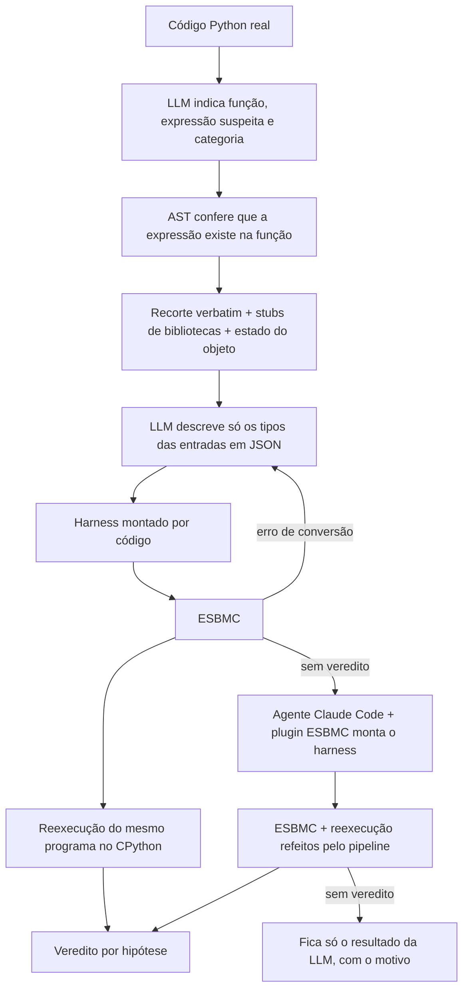

# llm-esbmc-pipeline

Pipeline de pesquisa que combina análise semântica por LLM com verificação formal por Bounded Model Checking (ESBMC) para detectar e confirmar bugs de runtime em código Python.

> **Contexto:** Dissertação de mestrado no PPGINF, área de Verificação de Software e Sistemas.
> Investiga se LLMs podem orientar o ESBMC a verificar propriedades em funções Python isoladas, usando a função como ponto de entrada simbólico.

---

## Pipeline atual

O fluxo principal é a **V2**: a LLM aponta onde está o bug no código real, o pipeline monta a
verificação sem deixar a LLM escrever código, e o ESBMC confirma ou não. A V1 continua disponível
como baseline experimental (seção de benchmark V1).


```mermaid
flowchart TD
    A[Código Python real] --> B[LLM indica função, expressão suspeita e categoria]
    B --> C[AST confere que a expressão existe na função]
    C --> D[Recorte verbatim + stubs de bibliotecas + estado do objeto]
    D --> E[LLM descreve só os tipos das entradas em JSON]
    E --> F[Harness montado por código]
    F --> G[ESBMC]
    G --> H[Reexecução do mesmo programa no CPython]
    H --> I[Veredito por hipótese]
    G -- erro de conversão --> E
    G -- sem veredito --> J[Agente Claude Code + plugin ESBMC monta o harness]
    J --> K[ESBMC + reexecução refeitos pelo pipeline]
    K --> I
    K -- sem veredito --> L[Fica só o resultado da LLM, com o motivo]
```

A verificação tem três níveis, e cada hipótese registra o nível que a decidiu (`levels` no
relatório):

1. **Harness determinístico** (`esbmc_engine`): o pipeline monta o programa e a LLM só dá os tipos.
2. **Agente** (`esbmc_agent`, opcional com `--agent-fallback`): quando o nível 1 não chega a um
   veredito do ESBMC, um agente escreve o harness: o Claude Code com o plugin ESBMC, ou qualquer LLM
   por API num ciclo em que o pipeline roda o ESBMC e devolve o erro (`--agent-backend`). O pipeline
   refaz o ESBMC e a reexecução. Se o agente simplificou a função (`--allow-simplify` no script), só
   conta como `CONFIRMED_SIMPLIFIED` quando os valores achados pelo ESBMC quebram a função original.
3. **Só a LLM** (`llm_only`): nenhum dos dois chegou a um veredito; o motivo é classificado em
   contexto da função, recurso de Python que o ESBMC não tem, falha interna do ESBMC, tempo,
   tipos inválidos ou função não encontrada.

Regras que definem o método (detalhes em [`docs/v2/desenho_motor_verify.md`](docs/v2/desenho_motor_verify.md)):

- **A hipótese é congelada:** localização e expressão não mudam entre tentativas.
- **A LLM não escreve código:** devolve só um JSON com tipos, pré-condições e o tipo de retorno de
  chamadas de bibliotecas ausentes. O harness é gerado pelo pipeline.
- **O código original entra sem alteração lógica:** as adaptações (estado do objeto, stubs de
  bibliotecas, cadeias `lib.a.b` renomeadas, formatação `%` reescrita) são determinísticas e
  ficam registradas em `transforms`.
- **Confirmação exige acordo:** o ESBMC aponta a violação **e** a execução real do mesmo programa
  reproduz a mesma exceção na linha da hipótese. Falsos positivos e falsos negativos do
  ESBMC-Python ficam separados (`UNVALIDATED`, `ESBMC_MISSED`).
- **Reparo limitado:** até 2 correções guiadas pelo erro do ESBMC; resultado seguro nunca é repetido.
- **Categoria é metadado:** não participa da verificação; a detecção é medida por localização.

| Veredito | Significado |
|---|---|
| `CONFIRMED` | ESBMC e execução reproduzem a mesma exceção na linha da hipótese |
| `ESBMC_MISSED` | a execução reproduz o bug e o ESBMC não detecta (falso negativo do verificador) |
| `UNVALIDATED` | o ESBMC aponta violação que a execução não reproduz |
| `OTHER_FAILURE` | a execução quebra em outra linha |
| `NOT_CONFIRMED` | nenhum dos dois encontra o bug |
| `UNSUPPORTED` / `MISSING_DEPENDENCY` | limite do ESBMC-Python ou do recorte |
| `SPEC_FAILED` | a LLM não produziu uma especificação válida |
| `GROUNDING_FAILED` | a expressão apontada não existe na função |
| `ESBMC_TIMEOUT` / `ESBMC_ERROR` | tempo esgotado ou falha do verificador |

| Fluxo | Modo | Descrição |
|---|---|---|
| **V2 (principal)** | `--mode hybrid` / `--mode benchmark` | Detecção pela LLM e verificação pelo motor descrito acima |
| **Flow A** | `--mode esbmc-only` | ESBMC puro: baseline formal sem LLM (V1) |
| **Flow B** | `--mode hybrid-direct` | LLM indica categoria e o ESBMC roda direto na função (V1) |
| **Flow C** | `--mode llm-only` | LLM pura, sem verificação formal (V1) |
| **Benchmark V1** | `--mode benchmark-v1` | Avalia os fluxos A+B+C com as métricas V1 |
| **Ensemble** | `--mode ensemble` | Voto entre modelos já rodados (V1) |

---

## Situação em 01/10/2026

Mesmas 116 hipóteses distintas de 30/09 (o relatório lista 125, com 9 repetidas), localização do bug
dada, mesmas especificações da LLM, ESBMC 8.5 release:

| | 30/09 | 01/10 |
|---|---|---|
| veredito do ESBMC pelo harness determinístico | 11 | 16 |
| veredito do ESBMC pelo agente (casos em que o nível 1 parou) | | 22 |
| confirmados | 2 | 9 (3 + 6) |
| confirmações falsas nas versões corrigidas (nível 1) | 0 | 0 |

Os 78 que ficam só com a LLM: 31 por contexto da função (nomes de outros arquivos, stubs, tipos de
entrada), 24 por recurso de Python que o ESBMC-Python não tem no próprio corpo da função, 8 por
falha interna do ESBMC, 7 por tempo, 4 porque o agente alterou a função, 4 por tipos inválidos ou
função não encontrada. Os do corpo da função só caem corrigindo o ESBMC; reescrever a função
deixaria de verificar o código real.

Ainda falta rodar o agente nas versões corrigidas (controle de confirmação falsa do nível 2).
Mudanças e medições: [`docs/projeto/harness_oraculo_esbmc_2026-10-01.md`](docs/projeto/harness_oraculo_esbmc_2026-10-01.md).

Detalhes e caminhos possíveis: [`docs/projeto/entendendo_o_pipeline.md`](docs/projeto/entendendo_o_pipeline.md)
(seções 9 e 10) e [`docs/projeto/duvidas_orientacao_2026-09-30.md`](docs/projeto/duvidas_orientacao_2026-09-30.md).

---

## Dataset

### V1: sintético (`dataset/labeled/`, 70 arquivos)

| Categoria | Arquivos | Verificável |
|---|---|---|
| `assertion_violation` | av_01–av_15 | ESBMC |
| `division_by_zero` | dz_01–dz_15 | ESBMC |
| `out_of_bounds` | oob_01–oob_15 | ESBMC |
| `clean` | clean_01–clean_10 | controle negativo |
| `complex_conditional` | cc_01–cc_05 | LLM heurístico |
| `long_method` | lm_01–lm_05 | LLM heurístico |
| `many_parameters` | mp_01–mp_05 | LLM heurístico |

Cada arquivo contém exatamente 1 função e 0 ou 1 bug. Sem `len()` (limitação do frontend Python do ESBMC).

### V2: mundo real (`dataset/v2_real_world/`, 116 bugs, 42 repositórios)

Cada item é um bug real de um projeto Python público, com o commit com bug e o commit de correção
registrados em `manifest.json` (campo `provenance`): 84 vêm do BugsInPy e 32 de correções aceitas
nos repositórios originais (commits, issues e pull requests). Repositórios com mais bugs: `scrapy`
(15), `thefuck` (11), `luigi` (10), `youtube-dl` (9), `tornado` (8), `matplotlib` (5).

| Pasta ou arquivo | Conteúdo |
|---|---|
| `detection/` | recorte da função, entrada da detecção pela LLM |
| `detection_full/` | arquivo completo no commit com bug (99 de 116), usado na verificação |
| `fixed_full/` | arquivo completo no commit corrigido (98), para medir confirmação falsa |
| `bugs/` | harness de referência escrito à mão (legado de 09/09; o motor novo não usa) |
| `patches/` | patch real da correção de cada caso |
| `ground_truths.json`, `manifest.json` | gabarito e proveniência, lidos só na avaliação |

`dataset/v2_candidates/` guarda 199 bugs do BugsInPy validados pelos mantenedores e ainda não
integrados ao dataset (ver o README da pasta).

O mapa de todas as pastas de `dataset/` (inclusive `code_smell/`, `historico/` e
`disciplina_pgene601/`) está em [`dataset/README.md`](dataset/README.md).

---

## Modelos V1

| Modelo | Backend | Tipo |
|---|---|---|
| `gpt-4o` | OpenAI | API (pago) |
| `claude-sonnet-4-6` | Anthropic | API (pago) |
| `deepseek-r1:7b` | Ollama (local) | Reasoning model |
| `qwen2.5-coder:7b` | Ollama (local) | Code model |

---

## Instalação

**Python 3.9+** (usa `ast.unparse()`).

```bash
git clone <repo>
cd llm-esbmc-pipeline
python -m venv .venv
source .venv/bin/activate
pip install -r requirements.txt
```

`requirements.txt` só traz `python-dotenv` e `pytest`: o resto do pipeline usa
biblioteca padrão do Python (nenhum SDK de LLM é dependência, as chamadas vão
por `urllib` puro).

**Requisito externo:** ESBMC 8.5.0. A V2 usa o binário oficial em `/usr/local/bin/esbmc` quando ele
existe (um build de desenvolvimento no PATH não é usado sem `--esbmc-command`).

```bash
/usr/local/bin/esbmc --version   # verificar instalação
```

Para modelos locais, instale o [Ollama](https://ollama.ai) e baixe os modelos:

```bash
ollama pull deepseek-r1:7b
ollama pull qwen2.5-coder:7b
```

Para a etapa de especificação da V2 sem cobrança por token, instale o
[Codex CLI](https://github.com/openai/codex) e autentique com a assinatura
ChatGPT/Codex já paga (em vez da API OpenAI, cobrada por token):

```bash
npm install -g @openai/codex
codex login
```

Use `--synth-backend codex` (ou `--backend codex` também na detecção, pra não
depender de `OPENAI_API_KEY` em nenhuma etapa) pra rodar por aí.

Pra usar a assinatura Claude já paga em vez da API Anthropic cobrada por
token, instale o [Claude Code CLI](https://claude.com/claude-code):

```bash
npm install -g @anthropic-ai/claude-code
claude   # primeira execução abre o fluxo de login no navegador
```

Use `--backend claude_cli` (detecção) e/ou `--synth-backend claude_cli`
(especificação). O pipeline chama `claude -p` local e filtra `ANTHROPIC_API_KEY` do
ambiente do subprocesso, então não precisa da chave em nenhuma etapa.

O backend Gemini disponível no pipeline é `google`, usando a API Gemini e
`GEMINI_API_KEY`. Não há atualmente um backend `gemini_cli` implementado; a
documentação anterior foi corrigida para não anunciar essa opção.

---

## Configuração

```bash
cp .env.example .env
```

```env
OPENAI_API_KEY=       # para gpt-* e --backend openai
ANTHROPIC_API_KEY=    # para claude-* e --backend anthropic
GEMINI_API_KEY=       # para --backend google
# OLLAMA_BASE_URL=    # opcional, padrão: http://localhost:11434
```

No modo `hybrid` (V2), a detecção usa o backend OpenAI por padrão
mesmo quando `--synth-backend codex` só troca a etapa de especificação:
`OPENAI_API_KEY` continua exigida a menos que `--backend` (detecção) também
seja `ollama`, `codex` ou `claude_cli`. Nenhuma chave é
necessária pra rodar o V2 inteiro com `--backend codex --synth-backend codex`,
`--backend claude_cli --synth-backend claude_cli`,
ou com `--backend ollama`
pra modelo local em ambas as etapas.

---

## Como rodar

### V2 ponta a ponta (fluxo principal)

```bash
PYTHONPATH=src .venv/bin/python src/main.py \
    --mode hybrid --v2-stage end-to-end \
    --input dataset/v2_real_world/detection \
    --ground-truth dataset/v2_real_world/ground_truths.json \
    --verification-sources dataset/v2_real_world/detection_full \
    --model gpt-4o-mini --synth-backend openai --synth-model gpt-4o-mini \
    --bound 5 --timeout 180 \
    --output-dir artifacts/v2/e2e
```

O relatório vai para `v2_verify_report.json` e o checkpoint para `v2_checkpoint.json`; para retomar,
repita o comando com `--resume`. Opções da V2:

| Opção | Efeito |
|---|---|
| `--v2-stage synthesis` | usa as hipóteses do gabarito e mede só a verificação (RQ2) |
| `--verification-sources DIR` | verifica no arquivo de mesmo nome em `DIR` (detecção segue no recorte) |
| `--verification-sources-strict` | pula o caso sem arquivo em `DIR` em vez de usar o recorte |
| `--spec-strategy resample` | amostras independentes com o mesmo orçamento, linha de base do reparo |
| `--agent-fallback` | nível 2: o agente (Claude Code + plugin ESBMC) tenta o que o harness determinístico não levou a um veredito; usa a assinatura do Claude Code |
| `--agent-backend` | `claude` (Claude Code + plugin, padrão) ou `openai`/`google`/`ollama`/`claude_cli`: o mesmo ciclo do agente por API, para quem não tem Claude Code (`ollama` roda modelo local) |
| `--agent-model`, `--agent-timeout` | modelo e tempo por sessão do agente (padrão: o do backend, 900 s) |

Scripts da V2:

| Script | Uso |
|---|---|
| `scripts/v2_replay_specs.py` | refaz uma rodada com as especificações que a LLM já deu, sem custo de API (mede mudanças no harness) |
| `scripts/v2_agent_reverify.py` | reavalia os harnesses que o agente já escreveu, sem chamar o agente |
| `scripts/v2_levels.py` | junta relatório e resultados do agente: nível que decidiu cada hipótese e motivo dos que ficam só com a LLM |
| `scripts/v2_verify_smoke.py` | funil sem LLM sobre o gabarito (e com ESBMC real usando `--esbmc`) |
| `scripts/v2_reverdict.py` | recalcula vereditos de um relatório sem chamar LLM nem ESBMC |
| `scripts/v2_agent_arm.py` | braço experimental: Claude Code + plugin ESBMC nos casos que o motor não roda |
| `scripts/fetch_v2_full_sources.py`, `scripts/fetch_v2_fixed_sources.py` | baixam os arquivos completos com bug e corrigidos |
| `scripts/collect_validated_bugs.py`, `scripts/label_candidates.py` | coletam e rotulam bugs validados em `dataset/v2_candidates/` |

### Benchmark V1 (baseline)

```bash
source .env

# Modelos via API
python src/main.py --mode benchmark \
    --input dataset/labeled/ground_truths \
    --model gpt-4o \
    --bound 5 --timeout 30 \
    --report reports/json/v1_benchmark/benchmark_gpt-4o.json

# Modelos locais Ollama (--llm-timeout maior pois inferência é lenta)
python src/main.py --mode benchmark \
    --input dataset/labeled/ground_truths \
    --model deepseek-r1:7b \
    --bound 5 --timeout 30 --llm-timeout 600 \
    --report reports/json/v1_benchmark/benchmark_deepseek-r1-7b.json
```

O prompt enviado à LLM contém somente o código da função e metadados básicos; operações pré-extraídas pelo AST não são expostas.

Se a execução for interrompida, repita o mesmo comando com `--resume`. O
checkpoint só é aceito com a mesma configuração. Execuções parciais retornam
código `2` e registram os casos ausentes em `coverage.failed_cases`.

Ver todos os comandos em [`TUTORIAL.md`](TUTORIAL.md).

### Modos auxiliares

```bash
# Fluxo híbrido legado (exploração/debug)
python src/main.py --mode hybrid-direct \
    --input dataset/labeled/ok/bugs \
    --model gpt-4o --bound 5 --timeout 30

# Flow A: ESBMC puro sem LLM
python src/main.py --mode esbmc-only \
    --input dataset/labeled/ok/bugs \
    --bound 5 --timeout 30

# Flow C: só LLM, sem ESBMC
python src/main.py --mode llm-only \
    --input dataset/labeled/ok/bugs \
    --model gpt-4o
```

---

## Prompt e schema LLM

O system prompt (`research_pipeline/prompts/system_prompt.txt`) segue estratégia **role + CoT** própria do projeto, com referências conceituais em Tamberg & Bahsi (IEEE Access 2025):

- **Role:** especialista em segurança de código Python em pipeline híbrido LLM+ESBMC
- **Taxonomia:** bugs formais (verifiable=true) vs. code smells (verifiable=false)
- **CoT:** 4 perguntas de raciocínio antes de gerar o JSON
- **Output:** `{"findings": [...]}`: sem markdown, booleanos JSON (`true`/`false`)

Schema simplificado (5 campos obrigatórios):

```json
{
  "finding_type": "suspected_bug | smell_heuristic | llm_false_positive",
  "category": "division_by_zero | out_of_bounds | assertion_violation | long_method | many_parameters | complex_conditional",
  "explanation": "raciocínio textual",
  "verifiable": true,
  "metadata": { "expression": "x / y" }
}
```

---

## Flags ESBMC por categoria (Flow B)

```python
{
    "division_by_zero":    ["--assign-param-nondet"],
    "out_of_bounds":       ["--assign-param-nondet"],
    "assertion_violation": ["--assign-param-nondet"],
}
```

`--function <nome>` é sempre usado: torna parâmetros simbólicos e permite BMC isolado por função.
O `--bound N` da CLI é aplicado ao incremental BMC como `--max-k-step N`.

---

## Classificações de resultado (V1)

| Classificação | Significado |
|---|---|
| `llm_confirmed_by_esbmc` | LLM + ESBMC confirmaram: principal métrica do Flow B |
| `not_confirmed_within_bound` | ESBMC não encontrou violação no bound |
| `esbmc_inconclusive` | Erro, timeout ou categoria ESBMC não bateu |
| `esbmc_native_bug` | Flow A detectou sem LLM |
| `llm_false_positive` | Expressão alucinada: não existe no AST executável |
| `heuristic_smell_only` | Code smell detectado só pela LLM |
| `out_of_scope_finding` | Categoria fora das 6 do benchmark |

---

## Métricas (V1)

O modo `benchmark` calcula:

- **P/R/F1** em nível de finding para bugs (Flow B), smells e Flow A
- **MCC e accuracy** em nível de função (binário: bug vs. não-bug)
- **FCR** (Formal Confirmation Rate): fração das hipóteses LLM confirmadas pelo ESBMC
- **NRR** (Noise Reduction Rate): redução de FP do Flow C para o Flow B
- **Bootstrap 95% CIs** (B=2000, seed=42)

Ver [`docs/v1/benchmark_reference.md`](docs/v1/benchmark_reference.md) para a especificação completa.

---

## Estrutura do projeto

```
llm-esbmc-pipeline/
├── src/
│   ├── main.py                     # CLI: --mode hybrid|benchmark (V2), benchmark-v1|hybrid-direct|esbmc-only|llm-only|ensemble (V1)
│   └── research_pipeline/
│       ├── preprocess.py           # Extrai CodeUnit por função via AST
│       ├── pipeline.py             # Orquestra os flows A/B/C da V1
│       ├── report.py, evaluator.py # Classificações e métricas da V1
│       ├── v2_evaluator.py         # Métricas de detecção da V2 (localização e categoria)
│       ├── llm/                    # Backends da LLM de detecção (openai, anthropic, ollama, google, codex, claude_cli)
│       ├── prompts/
│       │   ├── system_prompt.txt       # Detecção
│       │   └── input_spec_prompt.txt   # Especificação de entrada da V2
│       ├── verification/
│       │   └── esbmc_runner.py     # Chamada do ESBMC e leitura do resultado
│       └── verify/                 # Motor de verificação da V2
│           ├── grounding.py        # Aterramento, recorte verbatim, poda da classe
│           ├── slicing.py          # Stubs de bibliotecas não modeladas
│           ├── compat.py           # Reescritas equivalentes (formatação %)
│           ├── spec.py             # Tipos aceitos e validação do JSON da LLM
│           ├── render.py           # Montagem do harness
│           ├── replay.py           # Reexecução no CPython
│           ├── outcome.py          # Leitura do ESBMC e veredito
│           ├── loop.py             # Laço especificação → ESBMC → reparo
│           ├── report.py           # Resumo e avaliação
│           └── agent_arm.py        # Braço experimental com agente
├── dataset/
│   ├── labeled/                    # V1: 70 arquivos sintéticos
│   ├── v2_real_world/              # V2: 116 bugs reais (ver seção Dataset)
│   └── v2_candidates/              # 199 bugs validados aguardando integração
├── scripts/                        # Rodadas, coleta de dados e utilitários
├── tests/
├── docs/
│   ├── v1/                         # Referência da V1
│   ├── v2/                         # Desenho do motor de verificação da V2
│   ├── esbmc/                      # Instalação e referência do frontend Python
│   └── projeto/                    # Apresentação, auditorias, limites do ESBMC, leituras
├── .env.example
└── requirements.txt
```

---

## Testes

```bash
python -m pytest -q

# Somente quando quiser chamar APIs reais:
python -m pytest -m live_llm -q
```

---

## Documentação técnica

| Documento | Conteúdo |
|---|---|
| [`docs/v2/desenho_motor_verify.md`](docs/v2/desenho_motor_verify.md) | Desenho do motor de verificação da V2, vereditos e limitações |
| [`docs/v2/README.md`](docs/v2/README.md) | Como rodar a V2 e ler os resultados |
| [`docs/projeto/complemento_apresentacao_2026-09-30.md`](docs/projeto/complemento_apresentacao_2026-09-30.md) | Apresentação com os resultados atuais |
| [`docs/projeto/repro_esbmc_none/`](docs/projeto/repro_esbmc_none/) | Reprodutores mínimos de limites do ESBMC-Python |
| [`docs/v1/benchmark_reference.md`](docs/v1/benchmark_reference.md) | Especificação dos fluxos, flags ESBMC, métricas e metodologia V1 |
| [`docs/v1/pipeline_walkthrough.md`](docs/v1/pipeline_walkthrough.md) | Walkthrough arquivo por arquivo do pipeline V1 |
