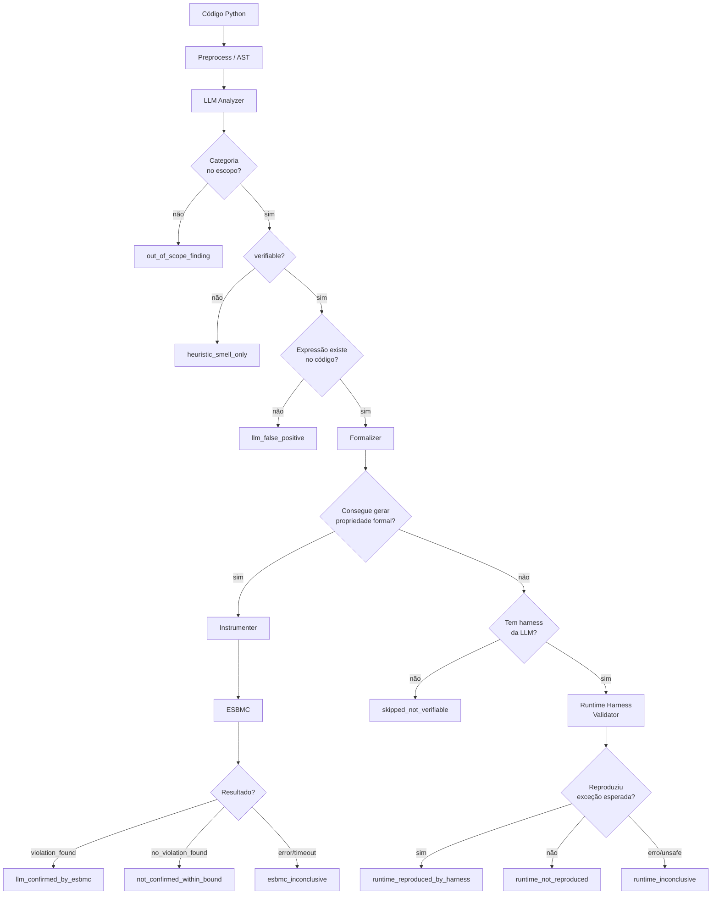

# Arquitetura do Pipeline LLM + ESBMC

## Visão geral

O pipeline combina análise semântica por LLM com verificação formal por BMC (Bounded Model Checking) para detectar e confirmar bugs de runtime em código Python.

## Camadas

### 1. Preprocess (AST)

**Arquivo:** `research_pipeline/preprocess.py`

Lê o código Python com o parser nativo (`ast`) e extrai:
- Funções e métodos (`CodeUnit`)
- Operações de divisão (`/`, `//`, `%`)
- Acessos indexados (`lst[i]`)
- Chamadas de método com acesso indexado (`.pop(i)`, `.__getitem__()`)
- Guards/asserts existentes
- Métricas (linhas, parâmetros, branches)

**Não é um gatekeeper.** Serve para enriquecer o prompt da LLM e corrigir números de linha.

### 2. LLM Analyzer

**Arquivo:** `research_pipeline/llm/`

Envia cada `CodeUnit` para a LLM com:
- Código da função
- Operações detectadas pelo AST
- Guards existentes
- Metadados

A LLM retorna findings com:
- `category`, `expression`, `verifiable`, `confidence`
- `expected_exception` (para bugs verificáveis)
- `reproduction_harness` (chamada mínima para reproduzir)

**Backends suportados:** OpenAI (Responses API), Anthropic (Messages API), Ollama (Chat Completions).

### 3. Normalization (llm/findings.py)

Valida os findings da LLM em três fases:

1. **Categoria no escopo?** — rejeita categorias fora dos 5 aceitos → `out_of_scope_finding`
2. **AST kind match** — procura operação com kind exato (rápido, enriquece linha)
3. **Existência no AST executável** — se kind não casa, verifica se a expressão existe como nó executável real (imune a comentários e strings)

Só marca `llm_false_positive` quando a expressão genuinamente não existe no código.

### 4. Formalizer

**Arquivo:** `research_pipeline/formalizer.py`

Converte o finding em propriedade formal verificável pelo ESBMC:

| Categoria | Assertion gerada |
|---|---|
| `division_by_zero` | `(denominador) != 0` |
| `out_of_bounds` | `(0 <= index) and (index < len(base))` |
| `assertion_violation` | condição do assert/raise extraída |

Retorna `None` se não consegue formalizar (aciona o harness).

### 5. Instrumenter

**Arquivo:** `research_pipeline/instrumenter.py`

Gera o arquivo Python instrumentado:
1. Remove entrypoints top-level (`main()`, `if __name__ == "__main__":`)
2. Injeta `assert <propriedade>` antes da operação suspeita
3. Gera driver simbólico `__esbmc_driver__()` com valores `nondet_int()`, `nondet_float()`, etc.
4. Escreve o arquivo em `artifacts/*/instrumented/`

### 6. ESBMC

**Arquivo:** `research_pipeline/esbmc_runner.py`

Executa `esbmc --python python3 --incremental-bmc <arquivo>` com timeout.

Classifica a saída:
- `"VERIFICATION FAILED"` → `violation_found`
- `"VERIFICATION SUCCESSFUL"` → `no_violation_found`
- `"Generated 0 VCC(s)"` + SUCCESSFUL → `no_vcc_generated`
- `"ERROR:"` sem VERIFICATION → `tool_error` ou `unsupported_case`
- Timeout → `inconclusive`

### 7. Runtime Harness Validator (fallback)

**Arquivo:** `research_pipeline/runtime_harness_validator.py`

Usado quando o Formalizer não consegue gerar propriedade formal. Executa o harness mínimo gerado pela LLM em subprocess isolado com timeout.

**Validação de segurança via AST** antes de qualquer execução — rejeita `import`, `eval`, `exec`, `open`, `while` sem limite, dunder methods perigosos.

**Não substitui o ESBMC.** É validação auxiliar para padrões que o BMC não consegue verificar formalmente.

### 8. Report / Classification

**Arquivo:** `research_pipeline/report.py`

Combina todos os resultados em `FinalResult` com `final_classification` e `interpretation`.

### 9. Full Report

**Arquivo:** `research_pipeline/full_report.py`

Organiza o flat `list[FinalResult]` em JSON hierárquico por arquivo, com seções `experiment`, `ground_truth`, `summary` e `files[]`.
