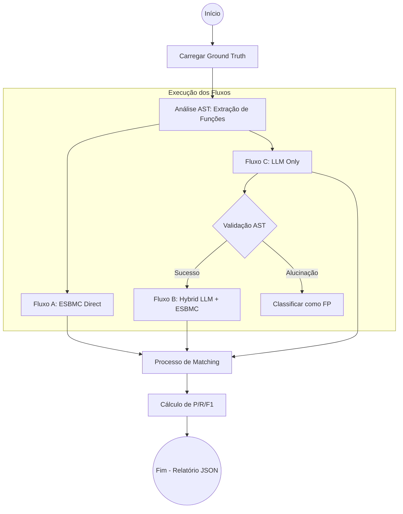
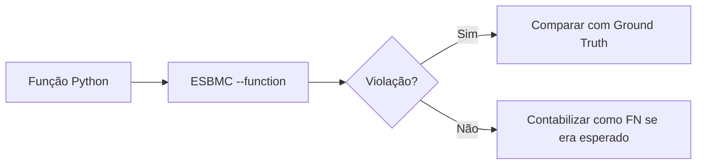
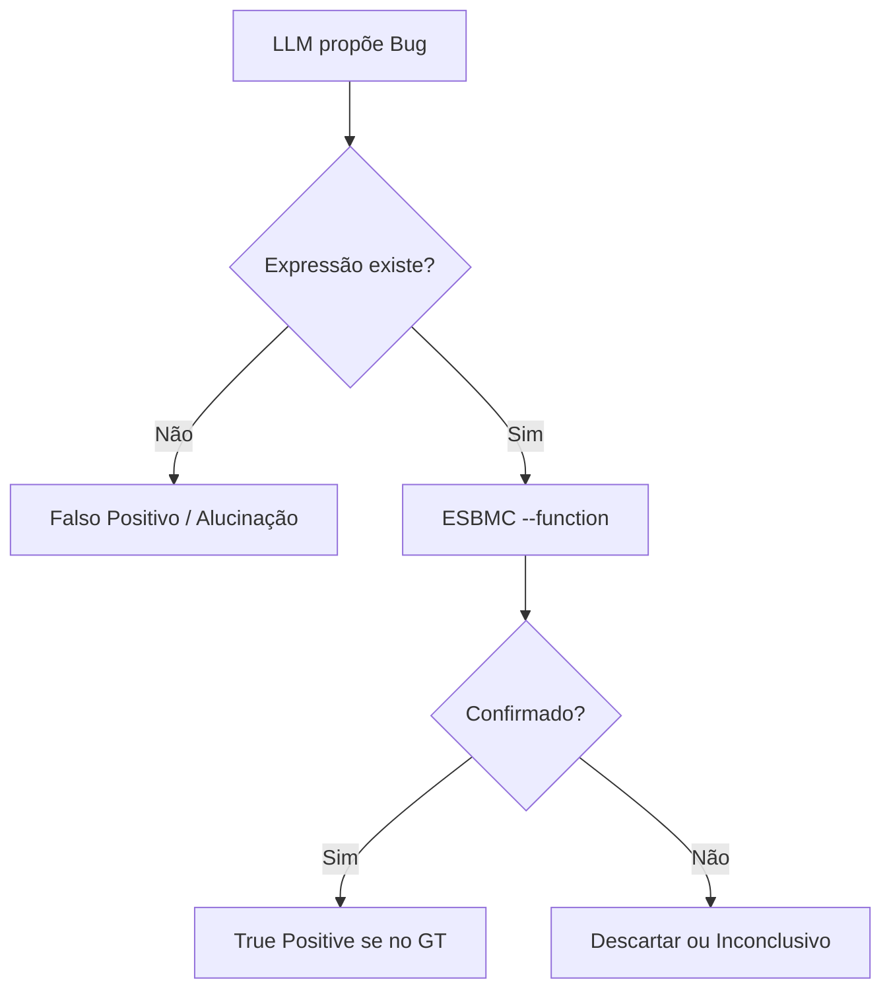

# Referência Oficial do Benchmark V1 — llm-esbmc

Este documento é a **única fonte de verdade** para a especificação, execução e interpretação do benchmark V1 do projeto `llm-esbmc`. Ele descreve o comportamento real implementado no pipeline.

---

# Visão Geral

O benchmark V1 é uma ferramenta de avaliação projetada para medir a eficácia de Modelos de Linguagem de Grande Escala (LLMs) na identificação de falhas de runtime em código Python, comparando-os com uma abordagem puramente formal baseada em Bounded Model Checking (ESBMC). O diferencial deste benchmark é o **Fluxo Híbrido**, onde a LLM atua como um guia para o verificador formal, reduzindo o espaço de busca e eliminando alucinações.

# Objetivo da Pesquisa

O objetivo central é demonstrar que LLMs podem orientar o ESBMC a verificar propriedades em funções isoladas que o BMC sozinho teria dificuldade de analisar por falta de pontos de entrada ou contexto de execução.

# Arquitetura do Pipeline

O pipeline opera em quatro estágios principais:
1.  **Preprocessamento (AST):** O código Python é analisado via AST (`research_pipeline/preprocess.py`) para extrair funções individuais, nomes qualificados e operações candidatas a bugs.
2.  **Análise LLM:** O código de cada função é enviado a uma LLM com um system prompt especializado. A LLM retorna uma lista de achados em formato JSON.
3.  **Validação AST:** Cada achado da LLM é validado contra o código real. Se a LLM apontar um bug em uma expressão que não existe no código, o achado é classificado como **Alucinação**.
4.  **Verificação Formal (ESBMC):** Achados verificáveis são enviados ao ESBMC usando a flag `--function`, tornando os parâmetros da função simbólicos.

# Estrutura do Dataset

O dataset (`dataset/labeled/`) está dividido em:
*   `ok/bugs/`: Arquivos Python contendo bugs de runtime reais.
*   `ok/clean/`: Arquivos Python sem bugs conhecidos (controles negativos).
*   `ok/smells/`: Arquivos Python com problemas de manutenção/qualidade.
*   `ground_truths/`: Arquivos JSON que mapeiam o comportamento esperado para cada arquivo Python.

# Ground Truth

Cada entrada de Ground Truth define:
*   `file`: Caminho do arquivo.
*   `function`: Nome exato da função onde o bug/smell ocorre.
*   `expected_category`: Categoria esperada do problema.
*   `verifiable`: `true` para bugs formais, `false` para smells.

# Categorias de Bugs (Verificáveis)

| Categoria | Descrição | Exceção Python |
| :--- | :--- | :--- |
| `division_by_zero` | Divisão inteira ou real por zero. | `ZeroDivisionError` |
| `out_of_bounds` | Acesso a índice de lista/array inexistente. | `IndexError` |
| `assertion_violation` | Violação de uma condição `assert`. | `AssertionError` |

# Categorias de Smells (Não Verificáveis)

| Categoria | Descrição |
| :--- | :--- |
| `long_method` | Funções com excesso de linhas de código. |
| `many_parameters` | Funções com muitos argumentos (padrão ≥ 5). |
| `complex_conditional` | Condicionais muito aninhadas ou complexas. |

# Fluxo A — ESBMC Direct

*   **Implementação:** `run_pipeline_esbmc_direct`
*   **Comportamento:** O pipeline ignora a LLM. Ele detecta todas as funções via AST e roda o ESBMC em cada uma delas com `--function`.
*   **Propósito:** Baseline tradicional de verificação formal.

# Fluxo B — Hybrid LLM + ESBMC

*   **Implementação:** `run_pipeline_multi`
*   **Comportamento:** A LLM propõe bugs. O pipeline valida se a expressão existe (AST) e, se sim, chama o ESBMC apenas para confirmar a hipótese da LLM.
*   **Propósito:** Demonstrar o ganho de precisão e foco trazido pela IA.

# Fluxo C — LLM Only

*   **Implementação:** `run_pipeline_llm_only`
*   **Comportamento:** A LLM analisa o código e o resultado é aceito sem qualquer verificação formal.
*   **Propósito:** Baseline de qualidade e alucinação da LLM pura.

# Configuração Experimental

*   **Temperatura:** todas as chamadas LLM usam `temperature = 0`.
*   **Seed:** o benchmark não usa seed explícita, pois nem todos os endpoints avaliados aceitam esse parâmetro. A reprodutibilidade LLM é controlada por `temperature = 0`, modelo fixado e prompt/dataset congelados.
*   **ESBMC:** Flow A e Flow B usam `--function`, `--unwind <bound>` e `--assign-param-nondet`.
*   **Padrão V1:** `bound = 5`, `timeout = 30s` por chamada ESBMC e `llm_timeout = 300s` por chamada LLM, salvo quando o comando de benchmark registrar explicitamente outros valores.

# Processo de Matching

Um achado gerado pelo pipeline (Finding) só é considerado um **Match** com o Ground Truth se:
1.  A **Categoria** for idêntica.
2.  O **Nome da Função** for idêntico.

Se a LLM acertar o bug mas errar a função, o sistema conta como um Falso Negativo (deixou de achar o real) e um Falso Positivo (achou um inexistente na função errada).

# Métricas de Avaliação

As métricas são calculadas em `research_pipeline/evaluator.py`:

## TP (True Positive)
*   **Flow C:** LLM reportou bug e ele existe no ground truth.
*   **Flow B:** LLM reportou, **ESBMC confirmou**, e o par categoria+função existe no ground truth.
*   **Flow A:** ESBMC detectou sozinho e está no ground truth.

## FP (False Positive)
*   **Flow C:** LLM reportou algo que não está no ground truth.
*   **Flow B:** ESBMC confirmou um bug que não está no ground truth **OU** o ESBMC deu resultado "Inconclusivo" em uma função que deveria estar limpa.
*   **Alucinação:** Qualquer bug reportado pela LLM onde a expressão não existe no código.

## FN (False Negative)
*   Ground truth previa um bug, mas o fluxo em questão não o detectou (ou o ESBMC deu timeout/erro no caso do Flow B).

## Precision / Recall / F1
Calculados de forma padrão:
*   `Precision = TP / (TP + FP)`
*   `Recall = TP / (TP + FN)`
*   `F1 = 2 * (P * R) / (P + R)`

## Function Accuracy / MCC
Para bugs formais, `function_accuracy` e `function_mcc` sao calculados no nivel de funcao. A matriz binaria usa somente os 45 casos de bugs formais como positivos e os 10 controles clean como negativos. Os 15 code smells sao avaliados separadamente e ficam fora do denominador do MCC de bugs.

## Hallucination Rate
Calculada como: `hallucination_count / total_verifiable_claims`.
*   `total_verifiable_claims` = TP + FP da LLM (excluindo ghost findings).

## Formal Confirmation Rate (FCR)
Calculada no Flow B como:
*   `FCR = llm_confirmed_by_esbmc / formal_attempts`
*   `formal_attempts = llm_confirmed_by_esbmc + not_confirmed_within_bound + esbmc_inconclusive`

A unidade da FCR e uma hipotese de bug verificavel proposta pela LLM, validada pelo AST e enviada ao ESBMC. Smells, clean controls sem hipotese de bug e alucinacoes rejeitadas pelo AST nao entram no denominador.

## Noise Reduction Rate (NRR)
Calculada para bugs formais como:
*   `NRR = (FP_llm_only - FP_hybrid) / FP_llm_only`

Onde `FP_llm_only` e o numero de falsos positivos de bugs no Flow C, e `FP_hybrid` e o numero de falsos positivos de bugs no Flow B. Se `FP_llm_only = 0`, a razao e matematicamente indefinida e o JSON reporta `0.0` apenas como convencao operacional para evitar divisao por zero. Valores negativos sao possiveis e indicam que o Flow B produziu mais falsos positivos que o Flow C sob as regras do benchmark.

# Estados Especiais do ESBMC

## Inconclusive
Ocorre quando o ESBMC retorna erro de execução, timeout ou quando encontra uma violação de categoria diferente da que a LLM previu (ex: LLM previu divisão por zero, mas o ESBMC achou um erro de memória não relacionado).

## Timeouts
Tratados como Falha de Verificação. No Flow B, um timeout em um bug real resulta em um Falso Negativo (o sistema não conseguiu provar a existência do erro).

## Tool Errors
Ocorrem por limitações do ESBMC (ex: sintaxe Python não suportada ou falha interna do solver). São registrados mas não contam como confirmação.

# Relatórios JSON

O modo benchmark gera um JSON com a seguinte estrutura:
```json
{
  "metrics": {
    "bugs_llm_only": { ... },       // Flow C
    "bugs_hybrid_pipeline": { ... }, // Flow B
    "esbmc_direct_baseline": { ... } // Flow A
  },
  "hallucinations": { "count": X, "rate": Y }
}
```

# Fluxograma Completo

Abaixo estão as representações visuais dos três fluxos de execução do pipeline.

### Fluxo Geral do Sistema


### Detalhamento dos Fluxos

#### Fluxo A: ESBMC Direct (Baseline)


#### Fluxo B: Hybrid (IA + Formal)


# Limitações Conhecidas

1.  **Unwinding Bound:** O parâmetro `--bound` limita a análise de loops. Bugs que ocorrem após o limite definido não serão confirmados (Falsos Negativos).
2.  **Ponto de Entrada:** O pipeline foca em funções individuais. Bugs que dependem de um estado global complexo inicializado fora da função podem não ser detectáveis.
3.  **Suporte Python:** O ESBMC suporta um subconjunto da linguagem Python. Bibliotecas complexas (pandas, numpy) podem gerar erros de ferramenta.

# Decisões Metodológicas

1.  **Strict Function Matching:** Decidimos exigir o nome exato da função para evitar "acertos por sorte" onde a LLM acerta o tipo de bug mas erra o local.
2.  **Smells vs Bugs:** Smells são mantidos como métrica separada e nunca são enviados ao ESBMC, pois são subjetivos/qualitativos.
3.  **Inconclusive como FP:** Se a LLM aponta para uma função limpa e o ESBMC trava ou dá erro, isso é contado como FP no fluxo híbrido para penalizar a LLM por enviar o verificador formal para caminhos inválidos.

# Glossário

*   **BMC:** Bounded Model Checking.
*   **VCC:** Verification Condition (Condição de Verificação).
*   **Finding:** Um achado bruto da LLM antes da validação.
*   **Ghost Finding:** Um bug suspeito pela LLM mas marcado como "não verificável" (excluído de certas métricas de alucinação).
*   **Qualname:** Nome qualificado de uma função (ex: `Classe.metodo`).
