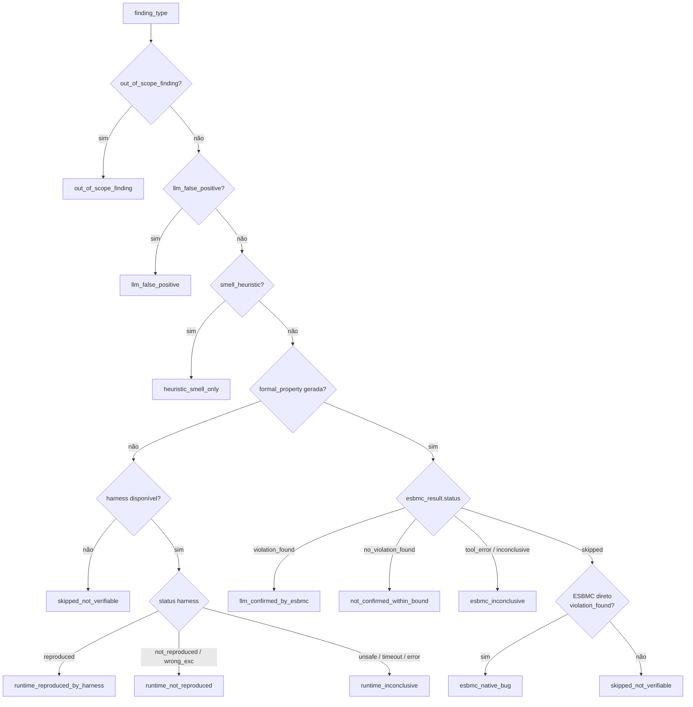

# Classificações do Pipeline

## Diagrama de decisão



## Tabela de classificações

### Trilha formal (ESBMC)

| Classificação | Significado | Peso na dissertação |
|---|---|---|
| `llm_confirmed_by_esbmc` | LLM identificou e ESBMC confirmou formalmente via BMC | **Principal** — prova formal |
| `not_confirmed_within_bound` | ESBMC verificou mas não encontrou violação no bound | Resultado negativo formal |
| `esbmc_inconclusive` | ESBMC retornou erro, timeout ou resultado ambíguo | Limitação da ferramenta |
| `esbmc_native_bug` | ESBMC direto detectou violação sem depender da LLM | ESBMC > LLM |
| `llm_missed_esbmc_bug` | ESBMC direto encontrou bug que a LLM não apontou | Falso negativo da LLM |

### Trilha runtime (harness)

| Classificação | Significado | Peso na dissertação |
|---|---|---|
| `runtime_reproduced_by_harness` | LLM identificou e execução runtime reproduziu a exceção | **Auxiliar** — não é prova formal |
| `runtime_not_reproduced` | Harness executou sem levantar a exceção esperada | Não confirmado em runtime |
| `runtime_inconclusive` | Harness rejeitado por segurança, timeout ou erro | Inconclusivo |

> **Importante:** `runtime_reproduced_by_harness` NÃO equivale a `llm_confirmed_by_esbmc`. O ESBMC usa verificação formal por BMC (explora todos os inputs simbólicos dentro do bound). O harness executa com uma entrada concreta específica. São formas de validação com pesos científicos diferentes.

### Rejeição / heurística

| Classificação | Significado |
|---|---|
| `llm_false_positive` | LLM citou operação que não existe no código executável (alucinação) |
| `heuristic_smell_only` | Smell de qualidade de código — sem verificação formal |
| `skipped_not_verifiable` | Formalizer não gerou propriedade e não há harness |
| `out_of_scope_finding` | Categoria fora das 5 aceitas pelo MVP |

### ESBMC direto (Flow A)

| Status | Significado |
|---|---|
| `violation_found` | ESBMC encontrou violação com ponto de entrada disponível |
| `no_violation_found` | ESBMC verificou e não encontrou violação no bound |
| `no_vcc_generated` | ESBMC retornou SUCCESSFUL mas gerou 0 VCCs — arquivo sem chamada top-level |
| `tool_error` | Erro interno do ESBMC (tipo não suportado, annotation ausente) |
| `unsupported_case` | Módulo Python não suportado pelo ESBMC (numpy, pandas, etc.) |
| `timeout` | Execução excedeu o tempo limite configurado |

## Separação formal vs. auxiliar na dissertação

```
Resultados formais (ESBMC):
  llm_confirmed_by_esbmc       → TP da trilha formal
  not_confirmed_within_bound   → FP ou limitação do bound
  esbmc_native_bug             → ESBMC superior à LLM

Resultados auxiliares (harness):
  runtime_reproduced_by_harness → evidência de runtime, não prova formal
  runtime_not_reproduced        → bug não reproduzível com os inputs testados

Falsos positivos da LLM:
  llm_false_positive            → alucinação detectada pelo AST
```

Nas métricas do benchmark, calcule F1 **separadamente** para cada trilha. Não some `llm_confirmed_by_esbmc` com `runtime_reproduced_by_harness` em um único TP.
