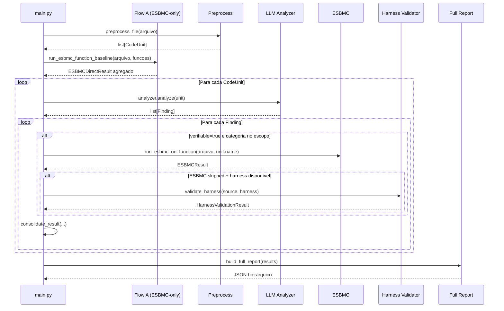
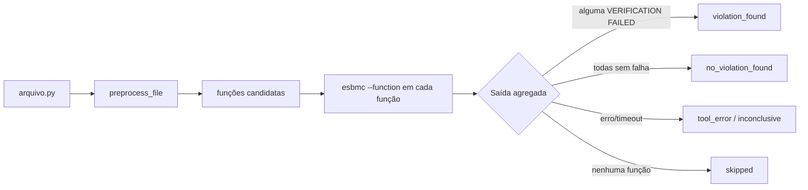
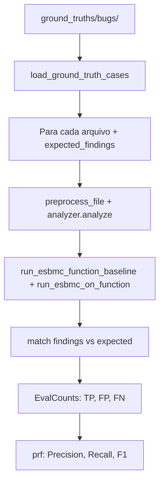
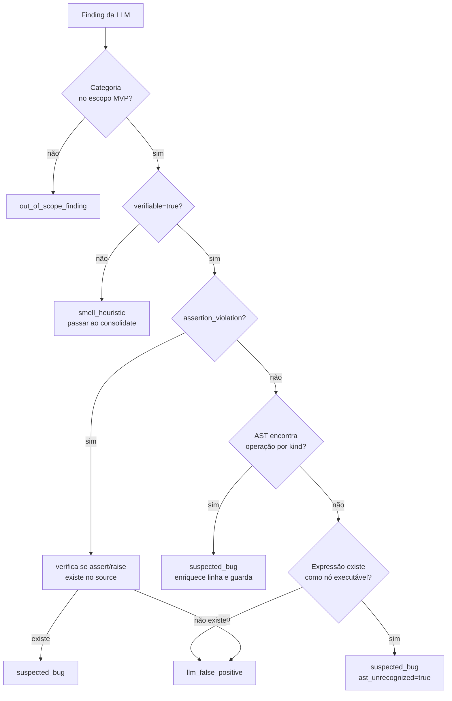

# Fluxo Detalhado do Pipeline

## Modo `full` (Flow A + Flow B)

## Modo `esbmc-direct` (Flow A puro)

**Observação:** o Flow A atual evita o problema de 0 VCCs em arquivos com apenas definições de função porque chama o ESBMC com `--function` para cada função candidata.

## Modo `llm-first` (Flow B puro)

Igual ao Flow B do modo `full`, mas sem o Flow A precedente. O campo `esbmc_direct` fica `null` no relatório.

## Modo `benchmark`

## Fluxo de normalização do finding (detalhe)

