# Fluxo do Pipeline LLM + ESBMC para Python

## Visao simples e detalhada do processo

**Ideia central**

- o codigo Python entra no pipeline
- a LLM analisa e gera achados
- o sistema separa o que e heuristico do que e verificavel
- o ESBMC valida formalmente o que for possivel

---

# Fluxo Geral

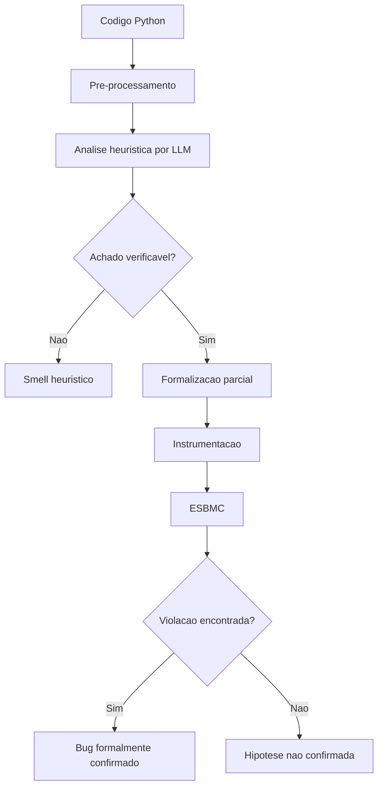

**Leitura do diagrama**

- o lado esquerdo representa a trilha heuristica
- o lado direito representa a trilha formal

---

# Etapa 1. Entrada

**O que entra**

- um arquivo Python real
- uma funcao
- um metodo
- ou um modulo completo

**Exemplo do prototipo**

- `minimal_index_division.py`

---

# Etapa 2. Pre-processamento

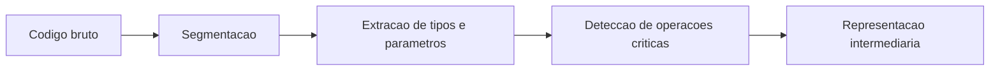

**O que essa etapa faz**

- separa funcoes e metodos
- extrai assinatura, parametros e tipos
- detecta operacoes relevantes
  - acesso indexado
  - divisao
  - loops
  - condicionais
  - asserts

**Importante**

Essa etapa nao diagnostica bug.  
Ela apenas organiza o codigo para a analise seguinte.

---

# Etapa 3. Analise Heuristica por LLM

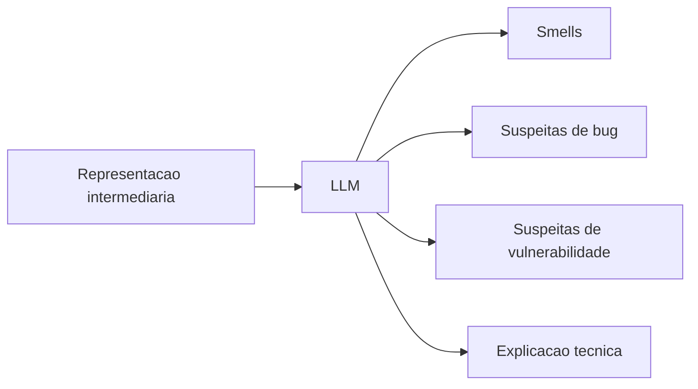

**O que a LLM faz**

- detecta smells
- detecta bugs suspeitos
- detecta vulnerabilidades suspeitas
- explica o raciocinio
- classifica inicialmente os achados

**O que a LLM nao faz**

- prova formal
- confirmacao matematica do defeito

---

# Etapa 4. Decisao: o achado e verificavel?

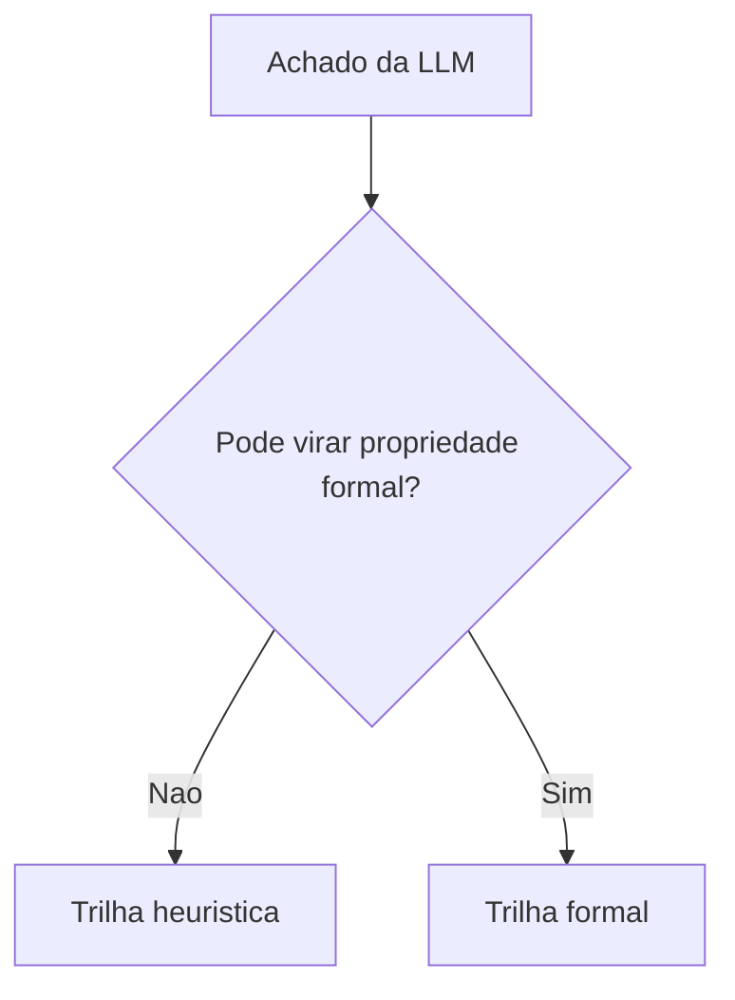

**Se nao for verificavel**

- permanece como smell ou risco heuristico
- segue apenas com explicacao textual

**Se for verificavel**

- segue para formalizacao
- depois instrumentacao
- depois ESBMC

---

# Trilha Heuristica

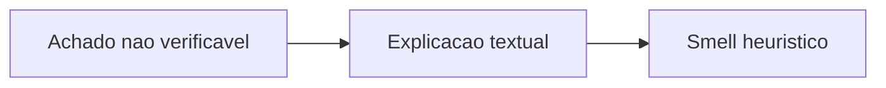

**Exemplos**

- `Long Method`
- `God Class`
- problemas arquiteturais
- riscos de manutencao

**Resultado final tipico**

- `smell_heuristic`

---

# Trilha Formal

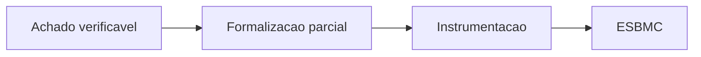

**Exemplos de achados verificaveis**

- acesso fora dos limites
- divisao por zero
- violacao simples de pre-condicao

---

# Etapa 5. Formalizacao Parcial

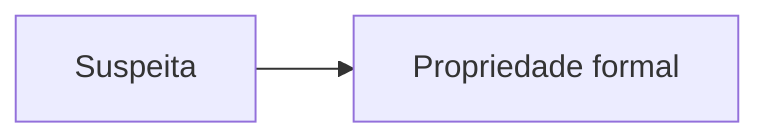

**Exemplos**

- `values[idx]` -> `0 <= idx < len(values)`
- `item // denom` -> `denom != 0`

**Por que parcial?**

Porque o sistema nao gera uma especificacao completa do programa.  
Ele gera propriedades locais associadas aos achados detectados.

---

# Etapa 6. Instrumentacao

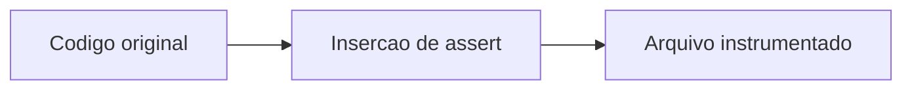

**O que acontece aqui**

- o pipeline cria uma copia derivada do codigo
- insere `assert` na linha relevante
- salva o arquivo em `artifacts/.../instrumented/`

**Importante**

Esse arquivo existe apenas para verificacao formal.  
Ele nao substitui o codigo original.

---

# Etapa 7. ESBMC

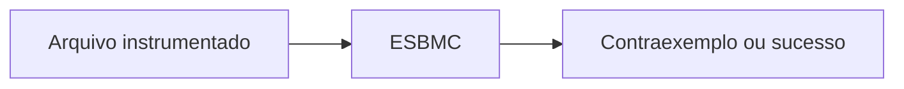

**O que o ESBMC faz**

- recebe o arquivo instrumentado
- aplica bounded model checking
- busca contraexemplos
- confirma ou refuta a hipotese formal

---

# Etapa 8. Interpretacao do Resultado

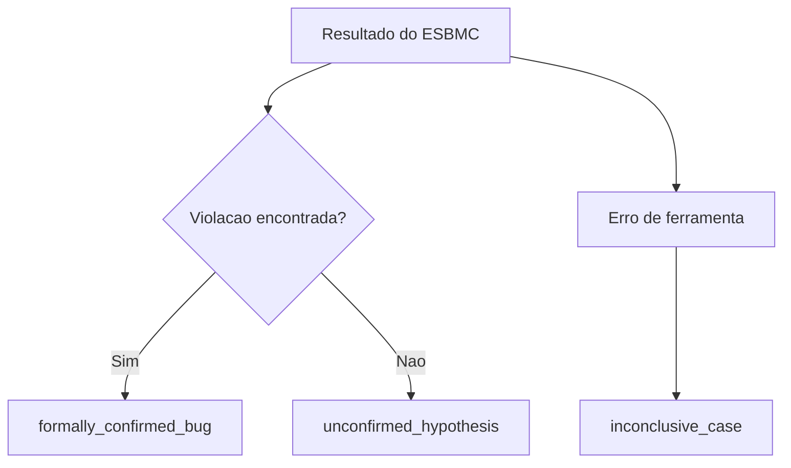

**Leitura**

- se o ESBMC encontra contraexemplo, o bug foi confirmado
- se nao encontra, a hipotese nao foi confirmada
- se a ferramenta falha, o caso e inconclusivo

---

# Exemplo Real do Fluxo

Arquivo analisado:

- `minimal_index_division.py`

Fluxo observado:

1. o pipeline detectou `values[idx]`
2. formalizou `0 <= idx < len(values)`
3. instrumentou o codigo
4. enviou o arquivo ao ESBMC
5. o ESBMC encontrou contraexemplo
6. resultado: `formally_confirmed_bug`

O mesmo aconteceu para:

- `item // denom`

---

# Mapa dos Modulos do Prototipo

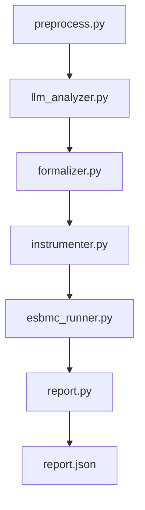

**Resumo**

- `preprocess.py` organiza o codigo
- `llm_analyzer.py` detecta e explica
- `formalizer.py` gera propriedades
- `instrumenter.py` cria o arquivo verificavel
- `esbmc_runner.py` chama o ESBMC
- `report.py` consolida a saida

---

# Mensagem Final do Fluxo

**Fluxo completo**

Codigo Python  
-> pre-processamento  
-> analise heuristica por LLM  
-> separacao entre heuristica e verificacao  
-> formalizacao parcial  
-> instrumentacao  
-> ESBMC  
-> classificacao final

**Resumo curto**

LLM detecta e explica.  
ESBMC valida.  
O pipeline separa heuristica de confirmacao formal.
