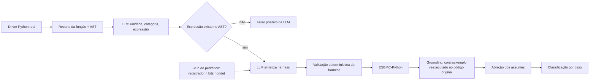

# Especificação do projeto: PGENE601 (2026/2)

**Disciplina:** Verificação e Síntese Automática de Sistemas Ciber-físicos e
Embarcados (PGENE601), Prof. Lucas Cordeiro.

**Título proposto:** *LLM propõe, ESBMC decide: confirmação formal de bugs em
drivers Python para sistemas embarcados*

**Formato exigido:** apresentação final de 20 minutos, artigo no template IEEE,
status semanal a partir de outubro (5 a 10 minutos, no máximo 5 slides).

**Tópicos da lista de sugestões aos quais o projeto se vincula:**
15 (ESBMC-Python), 26 (invariantes gerados por LLM para BMC),
32 (ESBMC-AI), 36 (classificação por verificação formal de código gerado por
LLM) e 31 (pipeline neuro-simbólico com modelos locais). O projeto reutiliza o
pipeline LLM + ESBMC da dissertação e muda o domínio de avaliação para código
Python que roda em microcontroladores.

---

## 5W2H resumido

| Pergunta | Resposta |
|---|---|
| **What** (problema e objetivo) | Medir se o pipeline LLM + ESBMC-Python confirma formalmente bugs reais em bibliotecas de drivers CircuitPython/MicroPython, e o que impede a confirmação. |
| **Why** (motivação) | Python já roda em microcontroladores e controla sensores e atuadores; o ESBMC-Python e o pipeline nunca foram avaliados nesse tipo de código. |
| **Where** (contexto) | Verificação formal de software embarcado por BMC, combinada com análise heurística por LLM. |
| **When** (cronograma) | Outubro a final de novembro de 2026, com status semanal. |
| **Who** | A aluna (grupo de até 2), sobre o pipeline já desenvolvido na dissertação. |
| **How** (método) | Mineração de bugs com commit de correção, execução do pipeline V2 e dos baselines, ablação, comparação com o corpus geral. |
| **How much** (métricas) | Precisão e revocação da detecção, taxa de confirmação no código real, taxa de harness aceitos pelo ESBMC, tempo de verificação, tokens por caso. |

---

## 1. Introdução

### 1.1 Contexto (where)

Este trabalho está situado na verificação formal de software embarcado por
Bounded Model Checking (BMC) baseado em SMT, combinada com análise heurística
por grandes modelos de linguagem (LLMs). Interpretadores como MicroPython e
CircuitPython executam Python em microcontroladores (RP2040, ESP32, SAMD51).
O ecossistema CircuitPython mantém centenas de bibliotecas de drivers que
convertem leituras brutas de registradores I2C/SPI em grandezas físicas
(temperatura, pressão, corrente, aceleração). Esse código é aritmético,
manipula bits e buffers de tamanho fixo e alimenta decisões de controle.

### 1.2 Problema (what)

Um pipeline em que a LLM aponta o bug e o ESBMC confirma, já avaliado em
software Python de propósito geral, consegue confirmar formalmente bugs reais
em drivers Python para sistemas embarcados?

A resposta pode ser sim ou não. Em ambos os casos o trabalho mede o motivo:
erro da LLM na detecção, harness rejeitado pelo frontend Python do ESBMC ou
dependência de hardware que o modelo não captura.

### 1.3 Motivação (why)

- Bugs aritméticos em drivers (divisão por zero em calibração, índice fora do
  buffer, valor de registrador fora da faixa) produzem leituras erradas que
  chegam ao controlador sem gerar exceção visível.
- Teste em hardware real é caro e cobre poucas entradas. O BMC explora todas
  as entradas até um limite e devolve um contraexemplo concreto.
- LLMs localizam código suspeito, mas produzem muitos falsos positivos. Na
  rodada de referência do pipeline sobre o corpus geral, a precisão da
  detecção foi 0,22. A verificação formal filtra esse ruído.
- O ESBMC-Python (Farias et al., 2024) foi avaliado em programas de propósito
  geral. Não há medição publicada sobre código de drivers embarcados.

### 1.4 Objetivos

**Hipótese.** Funções de conversão em drivers são majoritariamente
aritméticas e autocontidas depois que a leitura do periférico é substituída
por um valor não determinístico. Por isso, a taxa de confirmação no código
real deve ser igual ou superior à obtida no corpus geral.

**Objetivo geral.** Avaliar a taxa de confirmação formal do pipeline
LLM + ESBMC-Python sobre bugs reais de bibliotecas de drivers
CircuitPython/MicroPython e compará-la com a taxa obtida no corpus geral de
123 bugs de 42 repositórios.

**Objetivos específicos (com métrica):**

1. Construir um corpus de 10 a 15 bugs reais de drivers Python embarcados,
   cada um com commit buggy e commit de correção, em que 100% dos harnesses
   de referência reproduzem o bug no ESBMC e 0% o reproduzem na versão
   corrigida.
2. Medir precisão, revocação e F1 da detecção por categoria de bug, sem enviar
   o gabarito à LLM.
3. Medir a taxa de confirmação no código real, separada da confirmação apenas
   na abstração escalar, e compará-la com a do corpus geral.
4. Medir quanto um modelo de periférico (stub com leitura não determinística
   de registrador, restrita à largura de palavra do hardware) aumenta a fração
   de harnesses aceitos pelo ESBMC.
5. Catalogar as construções de código embarcado que o frontend Python do
   ESBMC não suporta (por exemplo `micropython.const`, `struct.unpack_from`,
   `memoryview`, propriedades de classe de driver) e quantificar quantos casos
   cada uma bloqueia.

---

## 2. Trabalhos correlatos

| Trabalho | Linguagem | LLM gera | Verificador | Bugs reais | Domínio embarcado | Confirma no código original |
|---|---|---|---|---|---|---|
| Farias et al., ESBMC-Python (ISSTA 2024) | Python | não | ESBMC | parcial | não | sim |
| Tihanyi et al., ESBMC-AI (AST 2025) | C | reparo | ESBMC | sim (CWE) | não | sim |
| Pirzada et al., invariantes por LLM (ASE 2024) | C | invariantes | ESBMC | benchmarks SV-COMP | não | sim |
| Tihanyi et al., FormAI (PROMISE 2023) | C | código | ESBMC | não (gerado) | não | sim |
| Tihanyi et al., segurança de código gerado (EMSE 2025) | C | código | ESBMC | não (gerado) | não | sim |
| Pirzada et al., neuro-simbólico (arXiv 2026) | C | raciocínio | ESBMC | benchmarks | não | sim |
| Chaves et al., DSVerifier em VANT (IEEE TR 2018) | C / ponto fixo | não | DSVerifier/ESBMC | sim | sim | sim |
| Dubniczky et al., CASTLE (ASE 2025) | C | detecção | vários | não (sintético) | não | não se aplica |
| **Este trabalho** | **Python** | **hipótese + harness** | **ESBMC-Python** | **sim** | **sim** | **sim, separado da abstração** |

Lacuna: os trabalhos que combinam LLM e ESBMC tratam C. O trabalho que trata
software embarcado (DSVerifier) não usa LLM. Nenhum avalia Python embarcado.

---

## 3. Referencial teórico

- **BMC e SMT** (Biere et al., 1999; Cordeiro et al., 2012): desdobramento do
  programa até um limite *k*, codificação em fórmula SMT, contraexemplo quando
  a negação da propriedade é satisfazível.
- **ESBMC e seu frontend Python** (Gadelha et al., 2018; Farias et al., 2024):
  conversão do AST Python anotado com tipos para o GOTO do ESBMC; parâmetros
  não determinísticos com `--function`; restrições com `__ESBMC_assume`.
- **Harness de verificação:** função de entrada que cria valores simbólicos,
  impõe pré-condições e chama o código sob teste.
- **Soundness da abstração:** uma pré-condição assumida pode excluir o caminho
  do bug. O pipeline testa isso por ablação: remove cada `assume` e verifica de
  novo.
- **Taxonomia de categorias** usada no pipeline: `division_by_zero`,
  `out_of_bounds`, `none_misuse`, `type_mismatch`, `integer_overflow`,
  `assertion_violation`, `invalid_precondition`, `variable_misuse`.
- **Modelo de periférico:** a leitura de um registrador de *n* bits vira um
  inteiro não determinístico em `[0, 2^n - 1]`. Isso aproxima o ambiente
  físico sem simular o barramento.

---

## 4. Método proposto

1. **Detecção.** A LLM recebe só o código da função, sem gabarito, e devolve
   unidade, categoria e expressão suspeita. O AST confirma que a expressão
   existe no código executável.
2. **Síntese do harness.** A LLM gera o harness. O estilo `verbatim-driver`
   preserva o código real; a síntese escalar fica como fallback e é contada
   separadamente.
3. **Modelo de periférico (contribuição nova).** Chamadas de leitura de
   barramento (`readinto`, `_read_register`) são substituídas por inteiros não
   determinísticos com a largura de palavra do registrador.
4. **Verificação e grounding.** O ESBMC verifica. O contraexemplo é
   reexecutado no código original para confirmar o bug fora da abstração.
5. **Ablação.** Cada `__ESBMC_assume` é removido para detectar harness
   restritivo demais.

**Baselines** (já implementados no pipeline):

- Flow A, `--mode esbmc-only`: ESBMC sem LLM.
- Flow C, `--mode llm-only`: LLM sem verificação.
- Pipeline V2 sem o modelo de periférico.

---

## 5. Entregáveis

1. Corpus de 10 a 15 bugs de drivers embarcados com proveniência, harness de
   referência e gabarito (mesmo formato de `dataset/v2_real_world/`).
2. Stub de periférico integrado ao pipeline como opção de linha de comando,
   com testes.
3. Relatório experimental: funil por etapa, P/R/F1, taxa de confirmação no
   código real, comparação com o corpus geral e catálogo de construções não
   suportadas.
4. Artigo no template IEEE e slides da apresentação final.
5. Artefatos reprodutíveis (comandos, versões do ESBMC e do modelo, JSONs).

---

## 6. Metodologia e cronograma

**Tipo de pesquisa:** experimental e descritiva, com análise quantitativa
(taxas e intervalos de confiança por bootstrap, já implementados) e análise
qualitativa das falhas.

**Atividades:**

1. Revisão dos trabalhos correlatos da lista de sugestões.
2. Seleção de repositórios: bibliotecas do Adafruit CircuitPython Bundle e
   `micropython-lib` com histórico de issues e commits de correção.
3. Mineração dos bugs: busca de commits de correção com termos como
   `ZeroDivisionError`, `IndexError`, `overflow`, `calibration`, `fix`.
   Critério de aceite: a função buggy é AST-idêntica ao commit pai e o harness
   de referência reproduz o bug apenas na versão buggy.
4. Implementação do stub de periférico.
5. Rodada do pipeline e dos baselines, com o mesmo modelo usado no corpus
   geral (comparação justa) e um modelo local (tópico 31).
6. Análise dos resultados e catálogo de limitações.
7. Escrita do artigo e preparação da apresentação.

| Atividade | S1 06/10 | S2 13/10 | S3 20/10 | S4 27/10 | S5 03/11 | S6 10/11 | S7 17/11 | S8 24/11 |
|---|---|---|---|---|---|---|---|---|
| 1. Revisão dos correlatos | X | X |  |  |  |  |  |  |
| 2. Seleção de repositórios | X |  |  |  |  |  |  |  |
| 3. Mineração e harness de referência |  | X | X |  |  |  |  |  |
| 4. Stub de periférico |  |  | X | X |  |  |  |  |
| 5. Rodadas do pipeline e baselines |  |  |  | X | X |  |  |  |
| 6. Análise e catálogo de limitações |  |  |  |  | X | X |  |  |
| 7. Artigo IEEE e apresentação |  |  |  | X | X | X | X | X |
| Status semanal (5 slides) | X | X | X | X | X | X | X |  |
| Apresentação final + artigo |  |  |  |  |  |  |  | X |

---

## 7. Conclusão (esperada)

O trabalho deve responder se o pipeline LLM + ESBMC-Python transfere para
código Python embarcado e quantificar onde ele falha. As contribuições
esperadas são: o primeiro corpus de bugs reais de drivers Python embarcados
com harness formal de referência; um modelo de periférico simples para
verificação de drivers; e um catálogo de construções que limitam o
ESBMC-Python nesse domínio, útil como desafio em aberto para o verificador.

**Riscos e mitigação:**

- Poucos bugs aritméticos documentados nos drivers: ampliar para
  `micropython-lib` e firmwares de robótica em Python.
- Frontend do ESBMC rejeita construções do driver: registrar no catálogo
  (objetivo 5) em vez de reescrever o código à mão.
- Custo de API: usar backends sem cobrança por token (`claude_cli`, `codex`)
  ou modelo local.

---

## Referências

- A. Biere, A. Cimatti, E. M. Clarke, Y. Zhu. Symbolic Model Checking without
  BDDs. TACAS, 1999. DOI: 10.1007/3-540-49059-0_14
- L. C. Cordeiro, B. Fischer, J. Marques-Silva. SMT-Based Bounded Model
  Checking for Embedded ANSI-C Software. IEEE TSE 38(4), 2012.
  DOI: 10.1109/TSE.2011.59
- M. Y. R. Gadelha et al. ESBMC 5.0: an industrial-strength C model checker.
  ASE, 2018. DOI: 10.1145/3238147.3240481
- B. Farias, R. Menezes, E. B. de Lima Filho, Y. Sun, L. C. Cordeiro.
  ESBMC-Python: A Bounded Model Checker for Python Programs. ISSTA, 2024.
  DOI: 10.1145/3650212.3685304
- M. A. A. Pirzada, G. Reger, A. Bhayat, L. C. Cordeiro. LLM-Generated
  Invariants for Bounded Model Checking Without Loop Unrolling. ASE, 2024.
  DOI: 10.1145/3691620.3695512
- N. Tihanyi, Y. Charalambous, R. Jain, M. A. Ferrag, L. C. Cordeiro. A New
  Era in Software Security: Towards Self-Healing Software via Large Language
  Models and Formal Verification. AST, 2025. DOI: 10.1109/AST66626.2025.00020
- N. Tihanyi et al. The FormAI Dataset. PROMISE, 2023.
  DOI: 10.1145/3617555.3617874
- N. Tihanyi et al. How secure is AI-generated code: a large-scale comparison
  of large language models. EMSE 30(2), 2025. DOI: 10.1007/s10664-024-10590-1
- M. A. A. Pirzada et al. Neuro-Symbolic Software Verification:
  Hyper-charging Local Language Models with Symbolic Reasoning at Scale.
  arXiv, 2026. DOI: 10.48550/arXiv.2606.16886
- L. C. Chaves et al. DSVerifier-Aided Verification Applied to Attitude
  Control Software in Unmanned Aerial Vehicles. IEEE TR 67(4), 2018.
  DOI: 10.1109/TR.2018.2873260
- R. A. Dubniczky et al. CASTLE: Benchmarking Dataset for Static Code
  Analyzers and LLMs Towards CWE Detection. ASE, 2025.
  DOI: 10.1007/978-3-031-98208-8_15
- P. V. Dantas, L. C. Cordeiro, W. S. S. Júnior. ESBMC: A Survey of Its
  Evolution, Integration, and Future Directions in Formal Software
  Verification. arXiv, 2026. DOI: 10.48550/arXiv.2605.26169

---

## Apêndice: primeiro status semanal (5 slides)

1. **Título e vínculo com a disciplina.** "LLM propõe, ESBMC decide" em
   drivers Python embarcados; tópicos 15, 26, 32 e 36 da lista.
2. **Problema e hipótese.** A pergunta da seção 1.2 e a hipótese da 1.4.
3. **Método.** O diagrama da seção 4, destacando o stub de periférico como
   peça nova.
4. **Ponto de partida medido.** Corpus geral: 102 bugs, 34 detectados na
   categoria certa (precisão 0,22), 21 harnesses compatíveis, 2 confirmados no
   código real. Esse é o número a comparar.
5. **Próximos passos.** Seleção de repositórios e mineração dos primeiros
   bugs (semanas 1 e 2 do cronograma).
