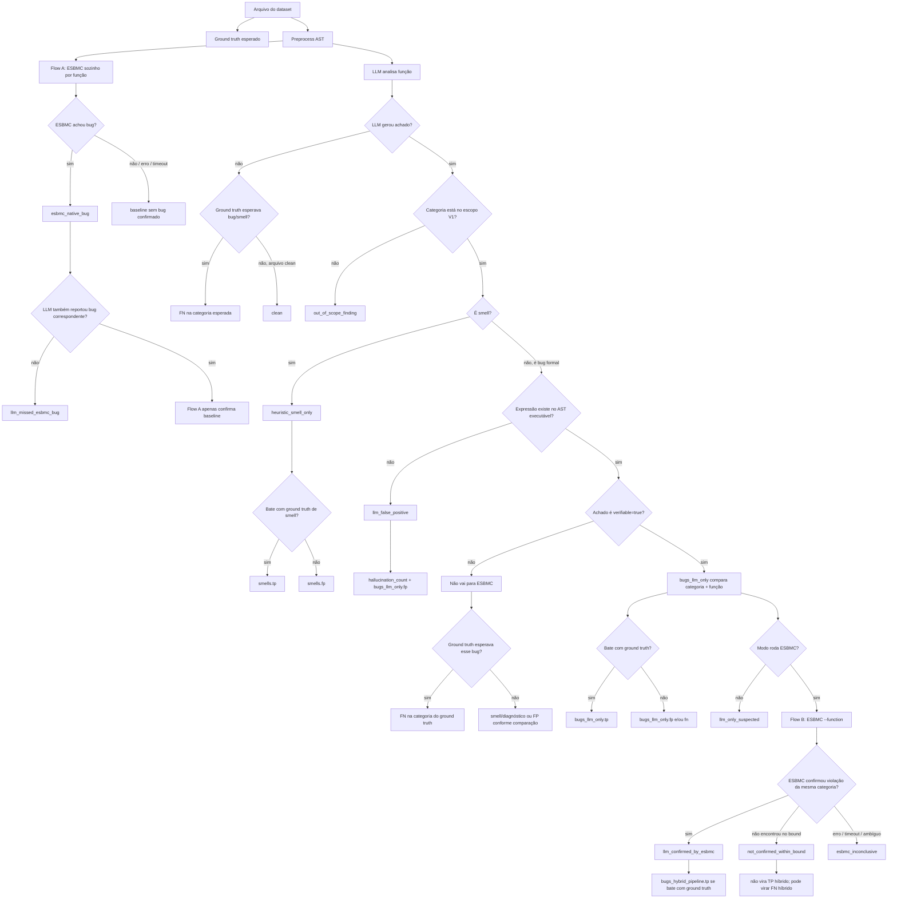

# V1 — Escopo do artigo

Esta versão é o foco da dissertação. O objetivo é demonstrar que LLMs podem orientar o ESBMC a verificar propriedades em código Python que o BMC sozinho não alcançaria.

## Fluxo principal

```
arquivo Python → LLM → AST → ESBMC --function → Relatório → Ground Truth
```

Ordem real de chamada da V1:

1. **Entrada/ground truth:** `src/main.py --mode benchmark` carrega os JSONs de `dataset/labeled/ground_truths` e resolve cada arquivo Python em `dataset/labeled/ok`.
2. **Preprocess:** `research_pipeline.preprocess.preprocess_file` usa AST para extrair funções, qualnames, operações e métricas.
3. **Flow A, quando habilitado:** `research_pipeline.verification.esbmc_runner.run_esbmc_function_baseline` roda ESBMC-only com `--function` em cada função descoberta.
4. **LLM analyzer:** `research_pipeline.llm.backends.factory.build_analyzer` escolhe o backend e o analyzer chama a LLM para cada `CodeUnit`.
5. **AST validation:** `research_pipeline.llm.findings.normalize_findings` valida expressão/categoria; alucinação vira `llm_false_positive`.
6. **Flow B:** `research_pipeline.verification.esbmc_runner.run_esbmc_on_function` roda ESBMC com `--function <funcao>` para achados verificáveis.
7. **Consolidação:** `research_pipeline.report.consolidate_result` transforma achado + ESBMC em classificação final.
8. **Avaliação/relatório:** `research_pipeline.evaluator.evaluate_model` compara com ground truth e calcula P/R/F1; o CLI grava o JSON passado em `--report`.

Ordem por modo:

| Modo | Ordem de chamada |
|---|---|
| `benchmark` | ground truth → preprocess → Flow A → LLM → AST validation → Flow B → métricas/JSON |
| `full` | arquivos Python → preprocess → Flow A → LLM → AST validation → Flow B → relatório JSON |
| `llm-first` | arquivos Python → preprocess → LLM → AST validation → Flow B → relatório JSON |
| `esbmc-direct` | arquivos Python → preprocess → Flow A → `esbmc_direct_results.json` |

## Categorias

### Bugs formais (verificáveis pelo ESBMC)

| Categoria | Exceção |
|---|---|
| `division_by_zero` | `ZeroDivisionError` |
| `out_of_bounds` | `IndexError` |
| `assertion_violation` | `AssertionError` |

### Code smells (heurísticos — secundários)

| Categoria |
|---|
| `long_method` |
| `many_parameters` |
| `complex_conditional` |

## Classificações principais

| Classificação | Descrição | Papel nas métricas |
|---|---|---|
| `llm_confirmed_by_esbmc` | ESBMC confirmou formalmente | **TP principal** |
| `not_confirmed_within_bound` | ESBMC verificou, sem violação no bound | FP ou limitação |
| `esbmc_inconclusive` | Erro, timeout ou ambiguidade | excluir do F1 |
| `llm_false_positive` | Alucinação detectada pelo AST | FP da LLM |
| `llm_only_suspected` | LLM suspeitou bug verificável, mas o modo não rodou ESBMC | usado em modo LLM-only/diagnóstico |
| `heuristic_smell_only` | Smell heurístico | métrica separada |
| `skipped_not_verifiable` | Achado não verificável no Flow B atual | registrar, excluir do F1 formal |
| `out_of_scope_finding` | Categoria fora do escopo V1 | registrar, não confirmar formalmente |
| `esbmc_native_bug` | Flow A achou sem LLM | baseline comparison |
| `llm_missed_esbmc_bug` | ESBMC achou, LLM não reportou | FN da LLM |
| `clean` | Arquivo sem achados no relatório agregado | controle negativo correto |

## Fluxo das classificações



Leitura curta:

1. `category` responde **qual problema é**: `division_by_zero`, `out_of_bounds`, `assertion_violation`, etc.
2. `final_classification` responde **o que aconteceu com o achado**: confirmado, falso positivo, inconclusivo, smell, fora do escopo.
3. `TP`, `FP` e `FN` são contadores calculados depois, comparando achados contra o ground truth.
4. Se o ground truth esperava bug verificável e a LLM marcou `verifiable=false`, o status não vira uma categoria nova: vira **FN na categoria esperada**.

## Como os status viram métricas

| Situação | Categoria usada | Status/contador | Efeito na métrica |
|---|---|---|---|
| Ground truth tem bug verificável e LLM reporta a mesma categoria/função com `verifiable=true` | Categoria do achado, ex: `division_by_zero` | `bugs_llm_only.tp += 1` | Acerto da LLM |
| Ground truth tem bug verificável, LLM reporta e ESBMC confirma a mesma categoria | Categoria do achado | `llm_confirmed_by_esbmc += 1`; `bugs_hybrid_pipeline.tp += 1` | Acerto do pipeline híbrido |
| Ground truth tem bug verificável, LLM não reporta bug verificável correspondente | Categoria do ground truth | `bugs_llm_only.fn += 1`; `bugs_hybrid_pipeline.fn += 1` | Bug esperado não encontrado |
| Ground truth tem bug verificável, LLM marca a categoria certa como `verifiable=false` | Categoria do ground truth | `bugs_llm_only.fn += 1`; `bugs_hybrid_pipeline.fn += 1` | A LLM não propôs bug formal verificável |
| LLM reporta bug extra que não bate com ground truth | Categoria reportada pela LLM | `bugs_llm_only.fp += 1` | Falso positivo da LLM |
| LLM reporta expressão que não existe no AST executável | Categoria reportada pela LLM | `llm_false_positive`; `hallucination_count += 1`; `bugs_llm_only.fp += 1` | Alucinação conta contra precision |
| LLM reporta bug verificável, mas ESBMC não confirma no bound | Categoria do achado | `not_confirmed_within_bound += 1` | Não vira TP híbrido; pode virar FN híbrido se era esperado |
| ESBMC retorna erro, timeout ou resultado ambíguo | Categoria do achado | `esbmc_inconclusive += 1` | Diagnóstico; não é confirmação formal |
| LLM reporta smell esperado | Categoria do smell | `smells.tp += 1` | Acerto de smell |
| LLM reporta smell extra ou em arquivo `clean` | Categoria do smell | `smells.fp += 1` | Falso positivo de smell |
| Ground truth tem smell e LLM não reporta | Categoria do ground truth | `smells.fn += 1` | Smell esperado não encontrado |
| Arquivo `clean` não recebe achados | `clean` | nenhum FP/FN | Comportamento correto |
| Arquivo `clean` recebe bug ou smell | Categoria reportada pela LLM | `bugs_llm_only.fp += 1` ou `smells.fp += 1` | Controle negativo falhou |
| Flow A encontra bug sem LLM | Categoria inferida da propriedade ESBMC | `esbmc_native_bug += 1`; `esbmc_direct_baseline.tp/fp/fn` | Baseline ESBMC-only |
| Flow A encontra bug e LLM não reporta achado correspondente | Categoria inferida da propriedade ESBMC | `llm_missed_esbmc_bug += 1` | Evidência de falso negativo da LLM |
| Achado não pode seguir para verificação formal | Categoria do achado | `skipped_not_verifiable += 1` | Diagnóstico; não é acerto formal |

`TP`, `FP` e `FN` não são categorias. Eles são contadores:

| Contador | Significado |
|---|---|
| `TP` | True Positive: esperado e encontrado corretamente |
| `FP` | False Positive: reportado, mas não esperado ou inválido |
| `FN` | False Negative: esperado, mas não encontrado |

## Modos de execução

```bash
# Pipeline completo (recomendado)
python src/main.py --mode full \
  --input dataset/labeled/ok/bugs \
  --model gpt-5.5-2026-04-23 \
  --bound 5 --timeout 30 \
  --report reports/json/full_v1_validation.json

# Benchmark com ground truth
python src/main.py --mode benchmark \
  --input dataset/labeled/ground_truths/bugs \
  --model gpt-5.5-2026-04-23 \
  --bound 5 --timeout 30 \
  --report reports/json/benchmark_v1.json

# Baseline ESBMC sem LLM
python src/main.py --mode esbmc-direct \
  --input dataset/labeled/ok/bugs \
  --bound 5 --timeout 30
```

## Ground truth

```
dataset/labeled/
├── ok/bugs/
│   ├── division_by_zero/    ← arquivos Python
│   ├── out_of_bounds/
│   └── assertion_violation/
└── ground_truths/bugs/
    ├── division_by_zero.json
    ├── out_of_bounds.json
    └── assertion_violation.json
```

## Métricas para o artigo

O modo `benchmark --report` gera:

```json
{
  "metrics": {
    "bugs_llm_only":         { "precision", "recall", "f1", "tp", "fp", "fn" },
    "bugs_hybrid_pipeline":  { "precision", "recall", "f1", "tp", "fp", "fn" },
    "smells":                { "precision", "recall", "f1", "tp", "fp", "fn" },
    "esbmc_direct_baseline": { "precision", "recall", "f1", "tp", "fp", "fn" }
  },
  "hallucinations": { "count", "rate" }
}
```

**Regras:**
- Calcular F1 **separadamente** para bugs formais e smells.
- `bugs_llm_only` mede o Flow C: achados da LLM depois da validação AST, sem ESBMC.
- `bugs_hybrid_pipeline` mede o Flow B: achados confirmados pela trilha formal LLM + AST + ESBMC `--function`.
- `esbmc_direct_baseline` mede o Flow A: ESBMC-only com `--function` por função, sem LLM.
- Casos `clean` são controles negativos: ausência de achados é comportamento correto; qualquer bug/smell reportado conta como falso positivo.
- Achados sem categoria verificável, sem expressão válida ou fora do escopo devem virar `skipped_not_verifiable`/`llm_false_positive`, nunca confirmação artificial.
- Flow A, Flow B e Flow C devem ser reportados separadamente.

## Tabelas sugeridas para o artigo

### Tabela 1 — Resultados por categoria

| Categoria | LLM findings | ESBMC confirmados | Não confirmados | Falsos positivos LLM | Inconclusivos |
|---|---|---|---|---|---|
| division_by_zero | | | | | |
| out_of_bounds | | | | | |
| assertion_violation | | | | | |

### Tabela 2 — Métricas por modelo

| Modelo | Bug P | Bug R | Bug F1 | Smells F1 | Alucinações |
|---|---|---|---|---|---|
| gpt-5.5-2026-04-23 | | | | | |
| claude-sonnet | | | | | |

### Tabela 3 — Flow A/B/C

| Métrica | Flow A: ESBMC-only | Flow B: LLM+ESBMC | Flow C: LLM-only |
|---|---|---|---|
| Precision | | | |
| Recall | | | |
| F1 | | | |
| Bugs encontrados | | |

## O que está fora da V1
Qualquer validação por execução concreta fica fora das métricas principais da V1.
