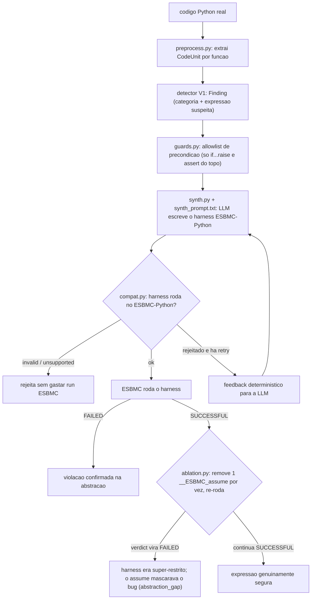

# Modo V2: detecção seguida de síntese de harness

Versão de trabalho, com caminhos de arquivo. Para orientador/banca, reescrever sem código.
Estado em 01/09/2026: `--mode v2` rodável ponta a ponta. A V1 permanece
concluída como baseline; a V2 reutiliza seu detector sem alterá-lo e acrescenta
a síntese e validação de harnesses.

O alvo é código Python real. Toda função extraída pelo `preprocess.py` passa pelo
mesmo analisador da V1. Para cada hipótese verificável, uma segunda chamada à LLM
sintetiza o modelo reduzido que o ESBMC verifica. `compat.py`, `guards.py` e
`ablation.py` limitam erros e super-restrições da abstração.

O experimento de qualificação usa os bugs reais já rotulados em
`dataset/v2_real_world/`. Apontar o mesmo comando para um repositório desconhecido
é tecnicamente possível, mas descoberta aberta não faz parte das métricas atuais:
sem ground truth, o relatório deve ser lido como lista de candidatos, não como
medição de precisão ou recall. Essa avaliação fica como evolução futura.

## Fluxo



## Módulos

| arquivo | passo | função |
|---|---|---|
| `src/main.py::mode_v2` | 1–2 | extrai funções e reutiliza o analisador da V1; somente findings verificáveis seguem para síntese |
| `scan/pipeline.py` | 3–6 | encadeia synth → compat → `run_esbmc_direct` → ablação. Classifica: `confirmed_on_abstraction` / `over_restricted` / `safe_on_abstraction` / `invalid_harness` / `unsupported_harness` / `no_property` / `esbmc_inconclusive` / `candidate_not_found` / `synth_failed` |
| `scan/compat.py` | 3 helper | rejeita harness que o ESBMC-Python não roda: não parseia / tem `import` / vaza numpy-pandas-torch / usa builtin não modelado (`zip`,`sum`,`sorted`...) / nome nondet inválido (`__ESBMC_nondet_int`) / **referencia nome nunca ligado no harness** (função externa não definida, ex. `safe_url_string`) / sem driver a nível de módulo |
| `scan/guards.py` | 3 helper | extrai a allowlist de precondição: só os `if cond: raise` e `assert cond` no topo do corpo viram `__ESBMC_assume` permitidos. Qualquer outro bound é super-restrição |
| `scan/synth.py` | 3 | `HarnessSynthesizer`: chama OpenAI Responses ou a API compatível do Ollama, monta o prompt (source + hipótese + bloco de precondição) e extrai o harness do fence ```python. Só é usado pelo modo V2 |
| `scan/ablation.py` | 3 backstop | harness deu SUCCESSFUL? Remove um `__ESBMC_assume` por vez, re-roda o ESBMC. Se o verdict vira FAILED, aquele assume mascarava o bug. Recebe um callable `run`, não roda ESBMC direto |
| `prompts/synth_prompt.txt` | 3 | system prompt: 10 regras (modela só a expressão suspeita, sem loop, builtins de uma lista curta, type hints, precondição = allowlist, `__ESBMC_cover` para reachability, driver a nível de módulo) |

## Proveniência das regras do `compat.py`

Não vieram do ESBMC nem dos agentes ESBMC. Mistura:

| regra | origem | firmeza |
|---|---|---|
| não parseia | `ast.parse`, Python puro | sólida |
| tem `import` | regra de estilo "harness self-contained", da caça manual 27-28/08 | escolha de design, não limite do ESBMC |
| numpy/pandas/torch | models existem no ESBMC (`numpy.py`, `torch.py`) mas incompletos; julgamento | aproximação, checar caso a caso |
| builtin não modelado | lista à mão; `enumerate`/`any` removidos após checar `src/python-frontend/README.md` do master | resto (`zip`,`map`,`filter`,`sorted`,`reversed`,`all`,`sum`) a confirmar |
| nome nondet errado | skill `esbmc-python-guide` + `models/nondet.py` | sólida |
| sem driver a nível de módulo | gotcha descoberto à mão, está no `CLAUDE.md` e na memória | sólida, testada |
| nome nunca ligado no harness (`Store` vs `Load`) | achado na validação end-to-end de 02/09 (8/26 harnesses chamavam função externa não definida, ex. `safe_url_string`, e travavam o ESBMC em erro interno); antes só `undefined_names()` avisava, agora `check_harness()` rejeita | sólida, com regressão em `tests/test_scan_compat.py::test_undefined_helper_call_is_invalid` |

## Uso

```bash
python3 src/main.py --mode v2 \
    --input dataset/v2_real_world/detection \
    --model gpt-4o-mini --bound 5 --timeout 45
```

Entrada: arquivo ou diretório Python. Saída: `artifacts/v2/v2_report.json` e os
harnesses sintetizados em `artifacts/v2/harnesses/`. O relatório separa a etapa
de detecção da etapa de síntese/verificação. OpenAI e Ollama são suportados.

Para avaliar contra os rótulos sem expô-los às LLMs:

```bash
python3 src/main.py --mode v2 \
    --input dataset/v2_real_world/detection \
    --ground-truth dataset/v2_real_world/ground_truths.json \
    --model gpt-4o-mini --output-dir artifacts/v2/gpt-4o-mini
```

O ground truth só é aberto depois que detecção, síntese e ESBMC terminam. O
relatório separa métricas da detecção, síntese condicionada a uma detecção
correta e resultado end-to-end. Use `--resume` com o mesmo comando para retomar
sem repetir funções ou hipóteses concluídas; mudanças nas fontes, prompts ou
configuração invalidam o checkpoint.

Para medir a síntese isoladamente com um modelo local, sem fornecer o harness
humano nem seu oráculo à LLM:

```bash
python3 src/main.py --mode v2 --v2-stage synthesis \
    --input dataset/v2_real_world/detection \
    --ground-truth dataset/v2_real_world/ground_truths.json \
    --backend ollama --model qwen2.5-coder:7b \
    --output-dir artifacts/v2/qwen2.5-coder-7b-synthesis
```

Nesse estágio, as hipóteses vêm do manifesto de avaliação. Por isso, o relatório
marca detecção e ponta a ponta como não avaliadas e calcula somente as métricas
de síntese condicionadas a uma hipótese correta.

## Proveniência e confirmação do gabarito (dataset/v2_real_world/)

Duas camadas, já fechadas, antes de qualquer harness sintetizado por LLM entrar em cena:

1. **Bug real.** Os 106 itens de `ground_truths.json` têm bloco `provenance` rastreando pra um
   commit de verdade: 76/106 via `bugsinpy_id` (base pública, revisada pela comunidade), os outros
   30 via `repo_url` + `commit_hash` direto do GitHub (a maioria com par `buggy_commit`/
   `fixed_commit`). Nenhum item é hipótese sem fonte.
2. **Harness feito à mão, confirmado pelo ESBMC.** `dataset/v2_real_world/README.md`, passo 6 do
   método: todos os 106 harnesses de `bugs/*.py` foram rodados com
   `esbmc file.py --z3 --unwind 6 --timeout 20s` e deram `VERIFICATION FAILED` com
   `Generated N VCC(s)`, `N > 0`, nunca prova vazia (0 VCC). É o gabarito, já confirmado, contra o
   qual o harness sintetizado por LLM é comparado.

O que ainda não estava medido até 02-03/09/2026: se o harness que a LLM sintetiza (V2, `scan/`)
chega no mesmo veredito desse gabarito já confirmado. É a run completa nos 106 candidatos.

## Como validar pela pasta de harnesses

Cada tentativa de síntese grava o arquivo em
`<output-dir>/harnesses/scan_<index>_<função>[_try<N>].py` (o `_tryN` só aparece a partir da 2ª
tentativa). Pra auditar um caso à mão:

1. Acha o índice/candidato no `v2_checkpoint.json` (`synthesis_results`) ou no `v2_report.json`
   final; cada entrada tem `classification`, `esbmc_status`, `compat_reasons`, `harness_path`.
2. Abre o `.py` naquele caminho e compara com o gabarito correspondente em
   `dataset/v2_real_world/bugs/<id>.py`: o harness da LLM reduziu a mesma expressão suspeita, com
   `nondet_*` no lugar certo, ou concretizou/mudou o que importa?
3. Pra `over_restricted`, `ablation_per_assumption` no mesmo registro nomeia qual `__ESBMC_assume`
   mascarava o bug (achado quando removê-la muda o veredito pra FAILED).
4. Pra `esbmc_inconclusive` com `esbmc_status: tool_error`, era o padrão do achado de 02/09
   (chamada a nome indefinido); agora `compat.py` barra isso antes de gastar um run de ESBMC.

## Estado

- `research_pipeline/scan/` é o nome interno legado dos componentes de síntese;
  eles só são importados pelo modo V2.
- O protótipo `hybrid --v2-manifest` foi removido: ele verificava um harness
  humano pronto e não representava a evolução LLM → harness pretendida.
- `compat.py` rejeita `for`/`while`, mantendo a validação alinhada à regra 2 do
  `synth_prompt.txt` (o harness deve reduzir o caso à expressão escalar suspeita).
- Tentativas adicionais recebem o harness anterior e os erros de `compat.py` ou
  ESBMC; o histórico, tokens e tempos de cada tentativa ficam no relatório.
- `over_restricted` é gap de abstração e não conta como confirmação.
- Smoke test local em `dz_real_01.py`: as duas tentativas do
  `qwen2.5-coder:7b` mantiveram NumPy; `compat.py` bloqueou corretamente o
  harness como `unsupported_harness` antes do ESBMC. Isso valida o caminho de
  feedback e evidencia que a taxa de síntese deve ser medida por modelo.
- **02/09/2026, validação end-to-end real contra os 106 candidatos.** Três falhas achadas e
  corrigidas nesta janela, cada uma só apareceu rodando contra código real, nenhuma em teste
  isolado:
  1. Super-restrição (28/08): LLM inventa bound que a função real não garante, prova vira vazia.
     Corrigido com `guards.py` (allowlist de precondição por AST) + `ablation.py` (remove uma
     `__ESBMC_assume` por vez, re-roda).
  2. Concretização (01/09): LLM fixa um valor constante em vez de manter símbolo (`x = [0.0, 0.2,
     0.8, 1.0]` fixo em `makeMappingArray`), divisor deixa de poder ser zero, bug some da prova.
     Corrigido reescrevendo `synth_prompt.txt` ancorado em `limitations.md`/`supported-features.md`/
     `models/esbmc.py` do ESBMC (commit `cbc6311`).
  3. Chamada externa não definida (02/09): harness chama função do projeto original (ex.
     `safe_url_string`) em vez de reconstruir com nondet; ESBMC trava em erro interno
     (`tool_error`). Em amostra de 26 candidatos reais, 8 terminaram assim. Corrigido tornando
     `undefined_names()` critério de rejeição em `check_harness()`, não só aviso; regra 5d nova no
     `synth_prompt.txt` (commit `278df52`, teste de regressão
     `test_scan_compat.py::test_undefined_helper_call_is_invalid`).
- **Gotcha de `--resume` confirmado ao vivo (02/09):** o fingerprint do checkpoint inclui prompt e
  fontes; ao mudar `synth_prompt.txt`/`compat.py` no meio de uma rodada, `--resume` recusa com
  "Não é seguro retomar" em vez de misturar resultado de prompt antigo com novo. Comportamento
  correto, mas exige rodar do zero (novo `--output-dir`) sempre que prompt ou `compat.py` mudam
  entre duas rodadas que serão comparadas.
- **03/09/2026, mais duas correções e a rodada completa fechada.** Depois do achado de 02/09, a
  validação end-to-end revelou mais duas falhas antes de fechar o número:
  4. Condição composta perde o marcador: `assert 0 <= idx < 1000, MARCADOR` é verificado pelo
     ESBMC-Python em passos internos separados, e só um carrega o marcador de volta ao pipeline.
     Corrigido no `synth_prompt.txt`: condição composta vira variável nomeada antes do assert
     (`ok: bool = 0 <= idx < 1000`).
  5. Assert depois de chamada que pode lançar sozinha: `int(nondet_str())` e acesso a dict/lista
     por chave/índice ausente disparam a própria checagem interna do ESBMC-Python antes do assert
     marcado ser alcançado no caso com bug. Confirmado com ESBMC real (`int()` inválido:
     `invalid literal for int() - digit out of range for base`, fonte
     `c2goto/library/python/string.c:1231`; dict: `uncaught exception`). Documentado como gotcha 9
     na skill `esbmc-python-guide`. Corrigido no prompt: assert tem que vir **antes** da chamada
     arriscada, checando a pré-condição que faltou, não a consequência.
  Nessa janela também apareceu uma regressão própria: bloquear todo `.método()` (tentativa de
  reforçar rule 5b) rejeitava operação barata e normal (`.isdigit`, `.get`, `.startswith`), caiu a
  taxa de confirmação de 57% pra 8%. Revertido; ficou só a checagem de tipo escalar (`abs()` em
  string, subscript em int/float/bool) e o marcador único por assert.
  Commits: `e2e4cbe` (marcador + tipo escalar), `4ba9edd` (fix não relacionado do resumo do ESBMC
  direto escondendo prova vazia), `73ae353` (layout `src/`).

## Diagnóstico da rodada completa (03/09/2026, ver commits acima)

Primeira medição de ponta a ponta nos 106 candidatos reais, todas as correções acima aplicadas.
Comando: `--mode v2 --input dataset/v2_real_world/detection --ground-truth
dataset/v2_real_world/ground_truths.json --model gpt-4o-mini`.

| etapa | número | leitura |
|---|---|---|
| detecção (cega) | precisão 34%, recall 36%, F1 35% | detector V1 sem alteração hoje; acha 42/117 rótulos |
| síntese, dado detecção correta | 83% compatível, **13% confirmado** (4/30) | camada mexida hoje |
| ponta a ponta | precisão 33%, **recall 3,4%** (4/117) | ≈ recall detecção × confirmação da síntese |

O recall final é baixo porque as duas etapas multiplicam: 0,36 × 0,13 ≈ 0,047, perto do 0,034
observado. Duas alavancas independentes, não uma.

### Causas concretas do 87% que não confirma (dado detecção correta)

Contagem sobre os 26 casos que não confirmaram: 9 `tool_error`, 19 `inconclusive` sem timeout
(3-8s de execução), 12 `invalid_harness` (rejeição do `compat.py` funcionando como desenhado), 12
`safe_on_abstraction`, 2 `over_restricted` (ablação pegando super-restrição, funcionando).

1. **Harness vazio por tipo, achado mais importante desta rodada.** Em `assertion_violation`/
   `type_mismatch`, a LLM modela `param: bool = nondet_bool()` e testa
   `assert isinstance(param, bool)`. `nondet_bool()` só produz `bool` por construção: o assert
   nunca pode falhar, a prova é vazia por tipo, não por `__ESBMC_assume`. `ablation.py` não pega
   isso porque não tem assume nenhum mascarando, o problema é o tipo declarado do parâmetro. 6 dos
   12 `safe_on_abstraction` têm essa forma. Ainda não corrigido: precisa de regra nova no prompt
   pra essas categorias usarem um tipo mais largo (`nondet_str()` representando "valor de origem
   não confiável") em vez do mesmo tipo que está sendo testado.
2. **Anotação de tipo fora do suportado.** Achado real: `data: object` e
   `isinstance(x, (list, tuple))` (forma de tupla) aparecem nos harnesses que travam em
   `tool_error`/`inconclusive`. `compat.py` hoje não valida que a anotação é uma das quatro
   suportadas (`int`/`float`/`bool`/`str`). Ainda não corrigido.
3. **19 casos inconclusivos sem timeout**, causa exata não investigada; precisa ler log bruto
   caso a caso antes de virar hipótese de correção.

### Ordem sugerida pra próxima sessão

1. Detecção (maior alavanca matemática: dobrar o recall da detecção quase dobra o número final,
   sem tocar em síntese; gap já mapeado em `docs/LEITURAS_RECOMENDADAS.md` §5.4).
2. Harness vazio por tipo (achado 1 acima).
3. Anotação de tipo não suportada (achado 2 acima).
4. Investigar os 19 casos inconclusivos (achado 3 acima).
