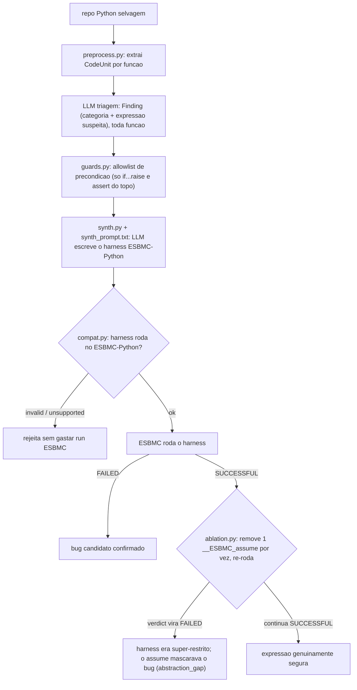

# Modo scan (V2): fluxo

Versão de trabalho, com caminhos de arquivo. Para orientador/banca, reescrever sem código.
Estado em 01/09/2026: `--mode scan` rodável ponta a ponta (`research_pipeline/scan/pipeline.py`).
Entrada = lista JSON de candidatos (não um repo). Ainda sem re-rodar o smoke test com guards+ablation.

O alvo é um repositório selvagem, sem gabarito. Toda função extraída pelo
`preprocess.py` vai para a triagem da LLM. A LLM sintetiza o modelo reduzido que o
ESBMC verifica (`research_pipeline/scan/synth.py`), em vez de o ESBMC rodar no
código original. `guards.py` e `ablation.py` impedem que a LLM invente uma
precondição que faz o bug sumir.

## Fluxo



## Módulos

| arquivo | passo | função |
|---|---|---|
| `scan/pipeline.py` | 4 | `run_pipeline_scan(candidates, synthesizer, ...)`: encadeia synth → compat → `run_esbmc_direct` → (se SUCCESSFUL) ablação. Classifica: `confirmed_on_abstraction` / `over_restricted` / `safe_on_abstraction` / `invalid_harness` / `unsupported_harness` / `no_property` / `esbmc_inconclusive` / `candidate_not_found` / `synth_failed`. `load_candidates()` lê o JSON de entrada |
| `scan/compat.py` | 3 helper | rejeita harness que o ESBMC-Python não roda: não parseia / tem `import` / vaza numpy-pandas-torch / usa builtin não modelado (`zip`,`sum`,`sorted`...) / nome nondet inválido (`__ESBMC_nondet_int`) / sem driver a nível de módulo |
| `scan/guards.py` | 3 helper | extrai a allowlist de precondição: só os `if cond: raise` e `assert cond` no topo do corpo viram `__ESBMC_assume` permitidos. Qualquer outro bound é super-restrição |
| `scan/synth.py` | 3 | `HarnessSynthesizer`: chama a OpenAI Responses API, monta o prompt (source + hipótese + bloco de precondição), extrai o harness do fence ```python. Chama API paga, só via modo scan |
| `scan/ablation.py` | 3 backstop | harness deu SUCCESSFUL? Remove um `__ESBMC_assume` por vez, re-roda o ESBMC. Se o verdict vira FAILED, aquele assume mascarava o bug. Recebe um callable `run`, não roda ESBMC direto |
| `prompts/synth_prompt.txt` | 3 | system prompt: 10 regras (modela só a expressão suspeita, sem loop, builtins de uma lista curta, type hints, precondição = allowlist, `__ESBMC_cover` para reachability, driver a nível de módulo) |

## Proveniência das regras do `compat.py`

Não vieram do ESBMC nem dos agentes ESBMC. Mistura:

| regra | origem | firmeza |
|---|---|---|
| não parseia | `ast.parse`, Python puro | sólida |
| tem `import` | regra de estilo "harness self-contained", da caça manual 27-28/08 | escolha de design, não limite do ESBMC |
| numpy/pandas/torch | models existem no ESBMC (`numpy.py`, `torch.py`) mas incompletos; julgamento | aproximação, checar caso a caso |
| builtin não modelado | lista à mão; `enumerate`/`any` removidos após checar `src/python-frontend/README.md` do master | resto (`zip`,`map`,`filter`,`sorted`,`reversed`,`all`,`sum`) a confirmar |
| nome nondet errado | skill `esbmc-python-guide` + `models/nondet.py` | sólida |
| sem driver a nível de módulo | gotcha descoberto à mão, está no `CLAUDE.md` e na memória | sólida, testada |

## Uso

```bash
python src/main.py --mode scan \
    --input dataset/v2_real_world/candidates_example.json \
    --model gpt-4o-mini --bound 5 --timeout 45
```

Entrada: lista JSON de `{file, function, category, expression?, note?}`. Saída: `artifacts/scan/scan_report.json`
+ os harness sintetizados em `artifacts/scan/harnesses/`. Síntese só via OpenAI por enquanto.

## Estado

- `research_pipeline/scan/` é aditivo: nenhum fluxo V1 importa dele.
- `--mode scan` rodável ponta a ponta (`scan/pipeline.py`, `mode_scan` em `src/main.py`).
- Gap: `compat.py` não rejeita harness com `for`/`while`, mas `synth_prompt.txt` regra 2 proíbe loop. Inconsistência a fechar.
- Pendente: re-rodar o smoke test com guards+ablation (mede se a super-restrição diminuiu vs ~2/4 e 3/4 de 28/08).
