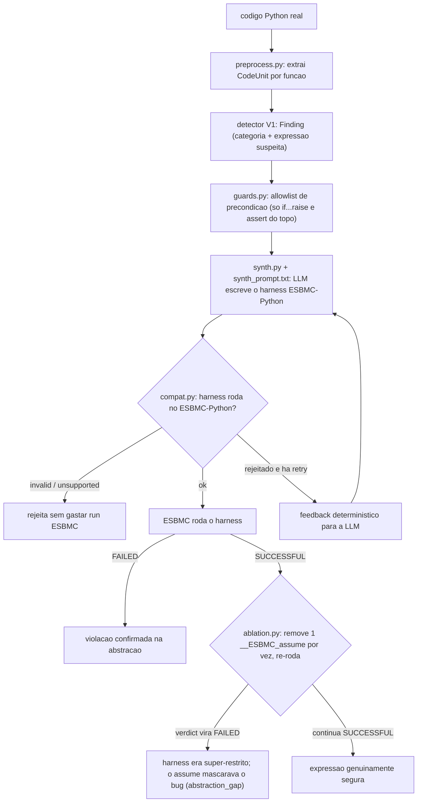

# Modo V2: detecção seguida de síntese de harness

Versão de trabalho, com caminhos de arquivo. Para orientador/banca, reescrever sem código.
Estado em 01/09/2026: `--mode v2` rodável ponta a ponta. A V1 permanece
concluída como baseline; a V2 reutiliza seu detector sem alterá-lo e acrescenta
a síntese e validação de harnesses.

O alvo é código Python real. Toda função extraída pelo `preprocess.py` passa pelo
mesmo analisador da V1. Para cada hipótese verificável, uma segunda chamada à LLM
sintetiza o modelo reduzido que o ESBMC verifica. `compat.py`, `guards.py` e
`ablation.py` limitam erros e super-restrições da abstração.

O experimento de qualificação usa os bugs reais já rotulados em
`dataset/v2_real_world/`. Apontar o mesmo comando para um repositório desconhecido
é tecnicamente possível, mas descoberta aberta não faz parte das métricas atuais:
sem ground truth, o relatório deve ser lido como lista de candidatos, não como
medição de precisão ou recall. Essa avaliação fica como evolução futura.

## Fluxo



## Módulos

| arquivo | passo | função |
|---|---|---|
| `src/main.py::mode_v2` | 1–2 | extrai funções e reutiliza o analisador da V1; somente findings verificáveis seguem para síntese |
| `scan/pipeline.py` | 3–6 | encadeia synth → compat → `run_esbmc_direct` → ablação. Classifica: `confirmed_on_abstraction` / `over_restricted` / `safe_on_abstraction` / `invalid_harness` / `unsupported_harness` / `no_property` / `esbmc_inconclusive` / `candidate_not_found` / `synth_failed` |
| `scan/compat.py` | 3 helper | rejeita harness que o ESBMC-Python não roda: não parseia / tem `import` / vaza numpy-pandas-torch / usa builtin não modelado (`zip`,`sum`,`sorted`...) / nome nondet inválido (`__ESBMC_nondet_int`) / sem driver a nível de módulo |
| `scan/guards.py` | 3 helper | extrai a allowlist de precondição: só os `if cond: raise` e `assert cond` no topo do corpo viram `__ESBMC_assume` permitidos. Qualquer outro bound é super-restrição |
| `scan/synth.py` | 3 | `HarnessSynthesizer`: chama OpenAI Responses ou a API compatível do Ollama, monta o prompt (source + hipótese + bloco de precondição) e extrai o harness do fence ```python. Só é usado pelo modo V2 |
| `scan/ablation.py` | 3 backstop | harness deu SUCCESSFUL? Remove um `__ESBMC_assume` por vez, re-roda o ESBMC. Se o verdict vira FAILED, aquele assume mascarava o bug. Recebe um callable `run`, não roda ESBMC direto |
| `prompts/synth_prompt.txt` | 3 | system prompt: 10 regras (modela só a expressão suspeita, sem loop, builtins de uma lista curta, type hints, precondição = allowlist, `__ESBMC_cover` para reachability, driver a nível de módulo) |

## Proveniência das regras do `compat.py`

Não vieram do ESBMC nem dos agentes ESBMC. Mistura:

| regra | origem | firmeza |
|---|---|---|
| não parseia | `ast.parse`, Python puro | sólida |
| tem `import` | regra de estilo "harness self-contained", da caça manual 27-28/08 | escolha de design, não limite do ESBMC |
| numpy/pandas/torch | models existem no ESBMC (`numpy.py`, `torch.py`) mas incompletos; julgamento | aproximação, checar caso a caso |
| builtin não modelado | lista à mão; `enumerate`/`any` removidos após checar `src/python-frontend/README.md` do master | resto (`zip`,`map`,`filter`,`sorted`,`reversed`,`all`,`sum`) a confirmar |
| nome nondet errado | skill `esbmc-python-guide` + `models/nondet.py` | sólida |
| sem driver a nível de módulo | gotcha descoberto à mão, está no `CLAUDE.md` e na memória | sólida, testada |

## Uso

```bash
python3 src/main.py --mode v2 \
    --input dataset/v2_real_world/detection \
    --model gpt-4o-mini --bound 5 --timeout 45
```

Entrada: arquivo ou diretório Python. Saída: `artifacts/v2/v2_report.json` e os
harnesses sintetizados em `artifacts/v2/harnesses/`. O relatório separa a etapa
de detecção da etapa de síntese/verificação. OpenAI e Ollama são suportados.

Para avaliar contra os rótulos sem expô-los às LLMs:

```bash
python3 src/main.py --mode v2 \
    --input dataset/v2_real_world/detection \
    --ground-truth dataset/v2_real_world/ground_truths.json \
    --model gpt-4o-mini --output-dir artifacts/v2/gpt-4o-mini
```

O ground truth só é aberto depois que detecção, síntese e ESBMC terminam. O
relatório separa métricas da detecção, síntese condicionada a uma detecção
correta e resultado end-to-end. Use `--resume` com o mesmo comando para retomar
sem repetir funções ou hipóteses concluídas; mudanças nas fontes, prompts ou
configuração invalidam o checkpoint.

Para medir a síntese isoladamente com um modelo local, sem fornecer o harness
humano nem seu oráculo à LLM:

```bash
python3 src/main.py --mode v2 --v2-stage synthesis \
    --input dataset/v2_real_world/detection \
    --ground-truth dataset/v2_real_world/ground_truths.json \
    --backend ollama --model qwen2.5-coder:7b \
    --output-dir artifacts/v2/qwen2.5-coder-7b-synthesis
```

Nesse estágio, as hipóteses vêm do manifesto de avaliação. Por isso, o relatório
marca detecção e ponta a ponta como não avaliadas e calcula somente as métricas
de síntese condicionadas a uma hipótese correta.

## Estado

- `research_pipeline/scan/` é o nome interno legado dos componentes de síntese;
  eles só são importados pelo modo V2.
- O protótipo `hybrid --v2-manifest` foi removido: ele verificava um harness
  humano pronto e não representava a evolução LLM → harness pretendida.
- `compat.py` rejeita `for`/`while`, mantendo a validação alinhada à regra 2 do
  `synth_prompt.txt` (o harness deve reduzir o caso à expressão escalar suspeita).
- Tentativas adicionais recebem o harness anterior e os erros de `compat.py` ou
  ESBMC; o histórico, tokens e tempos de cada tentativa ficam no relatório.
- `over_restricted` é gap de abstração e não conta como confirmação.
- Smoke test local em `dz_real_01.py`: as duas tentativas do
  `qwen2.5-coder:7b` mantiveram NumPy; `compat.py` bloqueou corretamente o
  harness como `unsupported_harness` antes do ESBMC. Isso valida o caminho de
  feedback e evidencia que a taxa de síntese deve ser medida por modelo.
